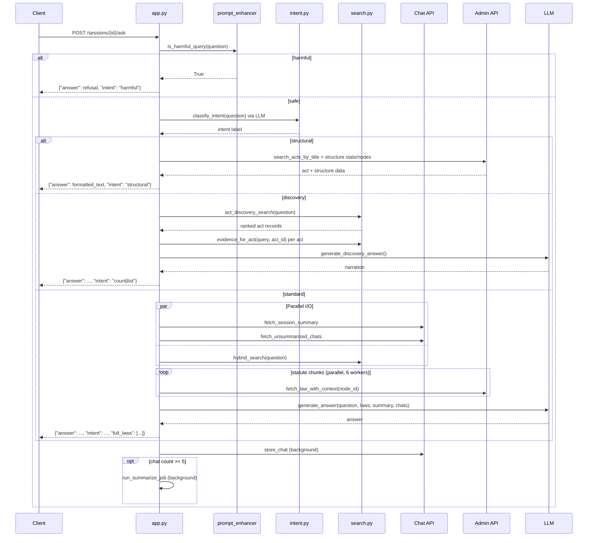

# System Overview: Legal RAG — Hybrid Retrieval-Augmented Generation for Sri Lankan Legal Query Resolution

---

> **Document Classification:** Academic Technical Report
> **System Version:** Current `main` branch — reflects all merged PRs through the act-metadata and multi-pipeline work
> **Prepared for:** Bachelor's / Master's Thesis Documentation

---

## Table of Contents

1. [Executive Summary](#1-executive-summary)
2. [System Architecture](#2-system-architecture)
3. [Core Features](#3-core-features)
4. [Safety & Compliance](#4-safety--compliance)
5. [Query Routing & Intent Classification](#5-query-routing--intent-classification)
6. [Knowledge Base & Ingestion Pipeline](#6-knowledge-base--ingestion-pipeline)
7. [Retrieval Pipeline](#7-retrieval-pipeline)
8. [Response Generation](#8-response-generation)
9. [Session & Memory Management](#9-session--memory-management)
10. [LLM Integration](#10-llm-integration)
11. [Project Structure](#11-project-structure)
12. [API Documentation](#12-api-documentation)
13. [Configuration](#13-configuration)
14. [Performance Optimizations](#14-performance-optimizations)
15. [Security](#15-security)
16. [Current Limitations](#16-current-limitations)

---

## 1. Executive Summary

### 1.1 Purpose

The **Legal RAG** system is a Retrieval-Augmented Generation service purpose-built to answer natural-language legal queries about Sri Lankan law — primarily Consumer Protection and Labour statutes and their associated case law. It bridges structured legal corpora with modern LLM reasoning, producing grounded, citation-backed answers while actively refusing requests that seek to exploit or circumvent the law.

### 1.2 What the System Solves

Access to legal knowledge is typically gated by high professional costs and complex legal language. Citizens and legal professionals struggle to find relevant statutory provisions or understand how courts have applied them. This system addresses that by:

1. Ingesting and indexing full statute text from a structured Legal Admin API.
2. Indexing court decisions (case law) that interpret those statutes.
3. Generating AI-produced metadata summaries for each Act to enable discovery queries.
4. Accepting plain-English questions, routing them through the appropriate pipeline, and returning grounded answers with source citations.
5. Refusing questions that seek to facilitate illegal, deceptive, or harmful activity.

### 1.3 System Maturity

The system has grown from a two-endpoint statute-only RAG to a multi-pipeline service with:
- **4 distinct query pathways** (harmful refusal, structural lookup, act discovery, standard explanation)
- **3 separate FAISS vector stores** (statutes, case law, act-level metadata)
- **2 LLM providers** (Groq + Gemini, auto-detected from available API keys)
- **15 REST endpoints**
- **13 Python source modules**

---

## 2. System Architecture

### 2.1 Architectural Style

The service is a **layered monolithic microservice**:

- **Monolithic** in deployment — a single Python `uvicorn` process.
- **Layered** internally — API → intent/safety → retrieval → generation → external I/O.
- **Microservice** in disposition — stateless, externalising all persistent data to remote APIs.
- **RAG pipeline** at its core — every explanation-type query follows a retrieve-then-read pattern.

### 2.2 High-Level System Boundaries

```
┌────────────────────────────────────────────────────────────────────┐
│                        Legal RAG Service                           │
│                                                                    │
│  ┌──────────┐ ┌─────────────┐ ┌──────────┐ ┌──────────────────┐  │
│  │  app.py  │ │  search.py  │ │  llm.py  │ │   client.py      │  │
│  │(routing) │ │(FAISS+BM25) │ │(Groq/Gem)│ │(HTTP gateway)    │  │
│  └──────────┘ └─────────────┘ └──────────┘ └──────────────────┘  │
│                                                                    │
│  ┌──────────────┐ ┌────────────┐ ┌──────────────┐ ┌───────────┐  │
│  │ intent.py    │ │discovery.py│ │legal_struc.. │ │prompt_enh.│  │
│  │(classify)    │ │(count/list)│ │(struct lookup)│ │(harm check)│ │
│  └──────────────┘ └────────────┘ └──────────────┘ └───────────┘  │
│                                                                    │
│           faiss_index/  (3 sets of .index + .pkl files)           │
└──────────────────────────────┬─────────────────────────────────────┘
                               │
             ┌─────────────────┼─────────────────┐
             ▼                 ▼                 ▼
   ┌──────────────────┐ ┌──────────────┐ ┌──────────────┐
   │ Legal Admin API  │ │   Chat API   │ │  LLM (cloud) │
   │ admin.ludexora.. │ │ ludexora.live│ │  Groq/Gemini │
   └──────────────────┘ └──────────────┘ └──────────────┘
```

**Inside boundary:** FastAPI server, all search and generation logic, ingestion scripts, local vector indexes.
**Outside boundary:** Legal Admin API (law source data), Chat API (session/chat persistence), LLM provider (inference).

### 2.3 Major Subsystems

| Subsystem | Modules | Role |
|---|---|---|
| API / Orchestration | `app.py` | Request routing, pipeline coordination, background tasks |
| Safety Layer | `prompt_enhancer.py` | Harmful query detection and refusal |
| Intent Classification | `intent.py` | Route each query to the correct pipeline |
| Hybrid Search | `search.py` | Three FAISS stores + BM25 + CrossEncoder reranker |
| Act Discovery | `discovery.py` | Count/list queries across the act corpus |
| Structural Lookup | `legal_structure.py` | Deterministic DB-backed structural queries |
| LLM Integration | `llm.py` | Answer generation, discovery narration, summarisation |
| External I/O | `client.py` | HTTP client to Admin API and Chat API |
| Ingestion — Statutes | `ingest.py` | Fetch, chunk, embed, index statutory law |
| Ingestion — Case Law | `ingest_caselaw.py` | Fetch, chunk, embed, index court decisions |
| Act Metadata | `metadata_gen.py` | Generate AI metadata per Act for discovery FAISS |
| Configuration | `config.py` | All constants and environment bindings |

### 2.4 Request Flow Overview

```
Incoming question
       │
       ▼
┌─────────────────────────────────────────────────────────┐
│  prompt_enhancer.is_harmful_query()                     │
│  → YES: return refusal immediately                      │
│  → NO: continue                                         │
└───────────────────────────┬─────────────────────────────┘
                            │
                            ▼
┌─────────────────────────────────────────────────────────┐
│  intent.classify_intent()  ── LLM call at temp=0.0     │
│  Labels: structural | count | list |                    │
│          explain | definition | compare | procedure | penalty │
└─────────────────────────────────────────────────────────┘
          │                   │                   │
          ▼ structural        ▼ count/list        ▼ everything else
   ┌─────────────┐     ┌─────────────┐     ┌──────────────────┐
   │legal_struct.│     │  discovery  │     │   hybrid search  │
   │DB lookup    │     │ act FAISS   │     │statute+caselaw   │
   │no LLM/FAISS │     │+ per-act ev.│     │FAISS+BM25+rerank │
   └──────┬──────┘     └──────┬──────┘     └────────┬─────────┘
          │                   │                      │
          ▼                   ▼                      ▼
   format_structural_   generate_discovery_     generate_answer()
   answer() — pure text  answer() — LLM         — LLM
```

---

## 3. Core Features

| Feature | Implementation |
|---|---|
| **Legal question answering** | Standard explanation pipeline: hybrid retrieval → context enrichment → LLM answer |
| **Semantic search** | FAISS `IndexFlatIP` with BAAI/bge-base-en-v1.5 embeddings (768-dim, cosine similarity) |
| **Hybrid retrieval** | FAISS semantic ∪ BM25 keyword candidates, then CrossEncoder reranking |
| **Dual corpus** | Separate indexes for statutes (legislation) and case law (judicial decisions) |
| **Citation generation** | LLM system prompt mandates Act name + section for statutes; case name + citation for case law |
| **Cross-reference resolution** | Statute chunks trigger Admin API call for law text plus all cross-referenced nodes |
| **Act discovery** | Semantic search over per-act AI metadata FAISS index; answers "how many acts cover X?" |
| **Structural queries** | Deterministic DB lookup for "how many sections in Act Y?" — no LLM or FAISS involved |
| **Conversation history** | Rolling LLM-generated summary + recent unsummarised chats sent as context |
| **History reference detection** | Regex patterns detect when a question references prior context; history fetch is skipped otherwise |
| **Multi-document context** | Up to 3 statute + 3 case law chunks passed to the LLM per query |
| **Evidence-based answers** | LLM system prompt enforces context-only answering; explicit refusal when context is insufficient |
| **Swappable LLM provider** | Auto-detects Groq or Gemini from available API keys; LLM_PROVIDER env var for explicit choice |
| **Background summarisation** | After every 5th chat exchange, rolling summary is updated in a non-blocking background task |
| **Selective history fetching** | `needs_history()` regex gates the I/O cost of fetching session context |

---

## 4. Safety & Compliance

### 4.1 Harmful Query Detection

Before any retrieval or LLM call, every incoming question is evaluated by `prompt_enhancer.is_harmful_query()`. This function applies 28 compiled regex patterns against the lowercased question text:

**Pattern categories:**

| Category | Example triggers |
|---|---|
| Tax fraud and evasion | `hide.*tax`, `tax.*fraud`, `evade.*tax`, `tax.*evasion` |
| Evidence tampering | `destroy.*evidence`, `tamper.*evidence`, `conceal.*evidence`, `hide.*evidence` |
| Avoiding law enforcement | `avoid.*getting caught`, `not.*get caught`, `get away with` |
| Money laundering | `launder`, `money laundering` |
| Fraud schemes | `fraud.*scheme`, `scheme.*fraud` |
| Bribery and corruption | `bribery`, `pay.*bribe`, `corrupt.*officer` |
| Embezzlement | `embezzl` |
| Concealment of crime | `cover.*illegal`, `cover.*crime`, `hide.*crime`, `hide.*activities` |
| Direct crime facilitation | `commit.*crime`, `commit.*fraud`, `commit.*offence` |

### 4.2 Refusal Workflow

```
User question
      │
      ▼
is_harmful_query(question)  ←── 28 regex patterns against lowercased text
      │
  YES │                         NO ──► normal pipeline
      ▼
get_refusal_response()  ←── static response string (no LLM call)
      │
      ▼
Return immediately: {"answer": refusal, "intent": "harmful", "full_laws": []}
      │
      ▼
_post_answer() as BackgroundTask
(stores the refusal in Chat API so conversation history is coherent)
```

The refusal response directs the user to consult a qualified attorney, contact the relevant regulatory authority, or review applicable laws for compliance guidance. No retrieval is performed. No LLM is called. The response is deterministic and immediate.

### 4.3 Differences from Normal Queries

| Aspect | Normal Query | Harmful Query |
|---|---|---|
| FAISS search | Performed | Skipped |
| Admin API calls | Performed | Skipped |
| LLM call | Performed | Skipped |
| Response latency | ~1–5 seconds | ~1ms (regex only) |
| `full_laws` field | Populated | Empty array |
| `intent` field | Classified label | `"harmful"` |
| Chat persistence | Background | Background |

### 4.4 Other Safety Guardrails

**Prompt-level grounding enforcement:**
The main LLM system prompt explicitly instructs the model to refuse answering when the retrieved context is insufficient: *"If the answer cannot be determined from the provided context, say so explicitly — do not guess or fabricate."*

**Temperature control:**
- Explanation answers: temperature 0.2 (low randomness, close to retrieved text)
- Discovery narration: temperature 0.1 (even lower — just enumerate the found Acts)
- Summaries: temperature 0.1 (faithful compression, not creative)
- Intent classification: temperature 0.0 (fully deterministic)

**Input validation:**
All request bodies are typed Pydantic models. FastAPI enforces types and rejects malformed payloads before any application logic runs.

**Startup token validation:**
`client.check_api_token()` probes the Admin API at startup. A 401 response raises a `RuntimeError` and kills the process, preventing the service from silently serving results against an invalid backend.

---

## 5. Query Routing & Intent Classification

### 5.1 Intent Labels

After the harm check, every question is classified by a single LLM call at temperature 0.0:

| Label | Meaning | Pipeline |
|---|---|---|
| `structural` | Questions about the internal structure of a **named Act** (sections/clauses count or list) | `legal_structure.run_structural_query()` |
| `count` | "How many laws/acts exist on topic X?" | `discovery.run_discovery()` |
| `list` | "Name all acts related to topic Y?" | `discovery.run_discovery()` |
| `explain` | What does a provision or law mean? | `hybrid_search()` → `generate_answer()` |
| `definition` | What does a legal term mean? | `hybrid_search()` → `generate_answer()` |
| `compare` | Compare two provisions or acts | `hybrid_search()` → `generate_answer()` |
| `procedure` | Steps to do something legally | `hybrid_search()` → `generate_answer()` |
| `penalty` | Punishments, fines, sentences | `hybrid_search()` → `generate_answer()` |

If the LLM returns an unexpected label, or if classification fails, the system defaults to `"explain"` (the standard pipeline).

### 5.2 Routing Logic

```python
# Structural check first — most specific, no fallback needed
if is_structural_intent(intent):
    return structural_pipeline(question)

# Discovery check — requires act_store to be loaded
if is_discovery_intent(intent) and act_store:
    return discovery_pipeline(question)

# All other intents → standard explanation pipeline
return standard_pipeline(question)
```

### 5.3 History-Relevance Detection

Inside the standard pipeline, a second regex check (`prompt_enhancer.needs_history()`) determines whether to fetch conversation context. This avoids unnecessary Chat API calls for self-contained questions.

Patterns that trigger history fetch include references like "that act", "as you mentioned", "elaborate", "tell me more", "from the previous message", "continue", etc. (18 patterns total). If none match, `summary` and `recent_chats` are both `None`, and the prompt is built without conversation context.

---

## 6. Knowledge Base & Ingestion Pipeline

### 6.1 Document Types

| Corpus | Source | API Endpoint | Content |
|---|---|---|---|
| **Statutes** | Legal Admin API | `GET /api/v1/nodes/leaf` + `/nodes/{id}/law-path` | Full text of leaf-level law nodes (sections, subsections, etc.) |
| **Case Law** | Legal Admin API | `GET /api/v1/case-laws` | Full text of decided court cases |
| **Act Metadata** | Legal Admin API + LLM | `GET /api/v1/acts` + LLM extraction | AI-generated summaries, keywords, domains, subjects per Act |

### 6.2 Chunking Strategy

Both statutes and case law use `RecursiveCharacterTextSplitter` from `langchain-text-splitters`:

- **Chunk size:** 800 characters
- **Overlap:** 100 characters
- **Splitter behaviour:** Tries to split on double newlines, then single newlines, then spaces, then characters — preserving sentence boundaries where possible.

Each statute chunk stores: `{"text": "[Node ID: {node_id}]\n\n{chunk}", "node_id": str, "act_id": int}`.

Each case law chunk stores: `{"text": "[CASE LAW] {case_name}\n\n{chunk}", "case_law_id": int, "case_name": str, "source": "caselaw"}`.

### 6.3 Embedding

All embeddings are produced by `BAAI/bge-base-en-v1.5` (768-dimensional, CPU inference):

- `normalize_embeddings=True` is passed at encode time, producing unit vectors.
- FAISS `IndexFlatIP` (inner product) on unit vectors is mathematically equivalent to cosine similarity.
- At query time, the BGE asymmetric query prefix is prepended: `"Represent this sentence for searching relevant passages: "` — following the model's intended usage for asymmetric retrieval (query instruction vs. passage embedding).

### 6.4 Act Metadata Index

For act discovery queries, a separate FAISS index stores one vector per Act. Each vector is the embedding of a concatenated string:

```
{title}  {summary}  {keyword1 keyword2 ...}  {regulated_activity1 ...}  {legal_domain1 ...}  {subject1 ...}
```

This metadata is produced by `metadata_gen.generate_act_metadata()`, which calls the LLM with a ~3000-character text sample from the Act and extracts a structured JSON object:

```json
{
  "summary": "One sentence describing what this Act regulates.",
  "keywords": ["word1", "word2"],
  "legal_domains": ["Commercial Law"],
  "regulated_activities": ["selling", "buying"],
  "subjects": ["consumers", "employers"]
}
```

Metadata is stored back in the Legal Admin API (`POST /api/v1/acts/{id}/metadata`) so it persists across index rebuilds and can be fetched with `GET /api/v1/acts/all-metadata`.

### 6.5 Local Index Files

All indexes are stored under `faiss_index/`:

| File | Format | Contents |
|---|---|---|
| `legal.index` | FAISS binary | `IndexFlatIP` over statute chunk embeddings (768-dim float32) |
| `chunks.pkl` | Pickle | `list[dict]` — statute chunk dicts with `text`, `node_id`, `act_id` |
| `bm25_corpus.pkl` | Pickle | `list[list[str]]` — tokenised statute chunks for BM25 |
| `caselaw.index` | FAISS binary | `IndexFlatIP` over case law chunk embeddings (768-dim float32) |
| `caselaw_chunks.pkl` | Pickle | `list[dict]` — caselaw chunk dicts with `text`, `case_law_id`, `case_name`, `source` |
| `caselaw_bm25.pkl` | Pickle | `list[list[str]]` — tokenised caselaw chunks for BM25 |
| `act_meta.index` | FAISS binary | `IndexFlatIP` over per-Act metadata embeddings (768-dim float32) |
| `act_meta_records.pkl` | Pickle | `list[dict]` — full metadata record per Act |

### 6.6 Ingestion Workflow (Statutes)

```
POST /vectordb/rebuild-statutes
        │
        ▼
Delete: legal.index, chunks.pkl, bm25_corpus.pkl
Clear: store dict in search.py
        │
        ▼
GET /api/v1/nodes/leaf  ←── all leaf law nodes
        │
        ▼
For each node: GET /api/v1/nodes/{id}/law-path  ←── full law text
        │
        ▼
RecursiveCharacterTextSplitter (800 chars, 100 overlap)
        │
        ▼
SentenceTransformer encode (normalize_embeddings=True)
        │
        ▼
FAISS IndexFlatIP.add(embeddings)
BM25 corpus = tokenised chunk texts
        │
        ▼
Write: legal.index, chunks.pkl, bm25_corpus.pkl
        │
        ▼
load_store() → store dict populated in memory
```

Case law ingestion follows the same steps using `GET /api/v1/case-laws` and writing to the caselaw files.

Act metadata rebuild (`POST /vectordb/rebuild-act-metadata`) calls `metadata_gen.generate_and_store_all(skip_existing=False)` to regenerate all Act metadata via LLM, then calls `build_act_store()` to build and persist the act-level FAISS index.

### 6.7 Index Load at Startup

```python
# app.py startup
if os.path.exists(INDEX_PATH):
    load_store()          # statute index (optional — service runs without it in 503 state)

load_caselaw_store()      # case law (no-op if files absent — graceful)
load_act_store()          # act metadata (no-op if files absent)
```

---

## 7. Retrieval Pipeline

### 7.1 Standard Hybrid Search

For `explain`, `definition`, `compare`, `procedure`, and `penalty` intents:

**Step 1 — Candidate retrieval (per corpus)**

```python
def _candidates(query, store, k):
    # Semantic arm: FAISS inner product search
    query_vec = embedder.encode([BGE_PREFIX + query], normalize_embeddings=True)
    _, faiss_idx = store["index"].search(query_vec, k)
    semantic_hits = set(faiss_idx[0].tolist())

    # Keyword arm: BM25 Okapi scoring
    bm25_scores = store["bm25"].get_scores(query.lower().split())
    bm25_top = set(argsort(bm25_scores)[::-1][:k].tolist())

    return [store["chunks"][i] for i in semantic_hits | bm25_top]
```

Candidate sizes: `CANDIDATE_K=20` statute candidates + `CASELAW_CANDIDATE_K=15` case law candidates = up to 35 total.

**Step 2 — Unified reranking**

All candidates (from both corpora) are scored jointly by `BAAI/bge-reranker-base` (CrossEncoder):

```python
pairs = [(query, chunk_text(c)) for c in statute_candidates + caselaw_candidates]
scores = reranker.predict(pairs)
ranked = sorted(zip(scores, candidates), reverse=True)
```

**Step 3 — Corpus-separated top-K selection**

After unified reranking, the ranked list is split by source:
- Statute hits: top `TOP_K=3`
- Case law hits: top `CASELAW_TOP_K=3`

This ensures both corpora contribute to the final context — a purely unified top-6 could discard all case law if statutes score higher, or vice versa.

### 7.2 Context Enrichment (Statutes Only)

After retrieval, statute chunks are resolved to full law text via the Admin API. The `chunk_node_id()` function extracts the `node_id` from each chunk dict, then `fetch_law_with_context(node_id)` is called in parallel (6-worker thread pool) to retrieve:

- The full law text of the node (not just the matched chunk)
- Cross-referenced nodes' full law text

Deduplication ensures the same node is not fetched twice. Cross-references are fetched only if their `node_id` has not already been seen.

Case law chunks are passed directly without an API call — they are already self-contained.

### 7.3 Act Discovery Search

For `count` and `list` intents, the act-level FAISS store is searched instead of chunk-level indexes:

```python
def act_discovery_search(query):
    query_vec = embedder.encode([BGE_PREFIX + query], normalize_embeddings=True)
    k = min(ACT_CANDIDATE_K, len(act_store["records"]))  # ACT_CANDIDATE_K = 50
    scores, indices = act_store["index"].search(query_vec, k)

    results = []
    for score, idx in zip(scores[0], indices[0]):
        if float(score) < ACT_SCORE_THRESHOLD:  # 0.25 — drops irrelevant acts
            break
        results.append({...act_record, "_score": float(score)})
    return results
```

Then for each matching act, `evidence_for_act(query, act_id)` fetches all statute chunks belonging to that act and reranks them by CrossEncoder, returning the top `EVIDENCE_TOP_K=2` chunks as supporting evidence.

### 7.4 Structural Query Lookup

For `structural` intent, no FAISS or LLM is involved in retrieval. The flow is:

1. `_extract_act_name(question)` — regex extracts the Act name (must end with Act/Law/Ordinance/Code/Statute and have ≥ 2 words).
2. `_extract_node_type(question)` — maps natural-language words to DB enum values (section→SECTION, clause→SUBSECTION, part→PART, chapter→CHAPTER, etc.).
3. `search_acts_by_title(act_name)` — Admin API title search returns up to 5 matching acts.
4. For count queries: `fetch_act_structure_stats(act_id)` returns precomputed counts per node type.
5. For list queries: `fetch_act_nodes_by_type(act_id, node_type)` returns ordered node list with `node_no` and `heading`.

The answer is formatted deterministically by `format_structural_answer()` — a pure text-formatting function with no LLM call.

### 7.5 Context Formatting Before LLM

```
[Conversation Summary]          ← only if use_history=True and summary exists
{old summary text}

[Recent Conversation]           ← only if use_history=True and recent chats exist
User: ...
Assistant: ...

[Relevant Legal Context]

[STATUTE]                       ← statute chunks tagged
{full law text from Admin API}

---

[CASE LAW] {case_name}         ← case law chunks tagged inline
{chunk text}

---

[Question]
{user question}
```

---

## 8. Response Generation

### 8.1 Standard Explanation Pipeline

`generate_answer()` in `llm.py` assembles the prompt from conversation memory, retrieved law blocks, and the question, then calls the LLM at temperature 0.2, max 1024 tokens.

The system prompt constrains the LLM to:
- Answer **only** from the provided legal context.
- Lead with the relevant **statute provision** (the rule).
- Use **case law** to show how courts have interpreted or applied that rule.
- **Cite** Act name + section for statutes; case name + citation for case law.
- Explicitly refuse if the context is insufficient — no fabrication.

If `hybrid_search` returns no results, the prompt contains no `[Relevant Legal Context]` block. The LLM then has no evidence and will state it cannot determine the answer — which is the correct behaviour.

### 8.2 Discovery Pipeline

`generate_discovery_answer()` uses a separate system prompt:

- States exact count first for count questions.
- Lists every act with a one-line description.
- Formats as `<number>. <Act Title> — <summary or domain>`.
- Does NOT invent acts not in the retrieved list.

If `act_discovery_search` returns no acts, the function short-circuits and returns a static "no relevant Acts found" message — no LLM call.

### 8.3 Structural Pipeline

`format_structural_answer()` is pure text formatting:
- For count questions: `"The {act_label} contains {N} {sections/parts/...}."`
- For list questions: the above plus a bulleted list `"• Section {no}: {heading}"`.
- Error messages if act not found or stats unavailable.

No LLM is called. The answer is deterministic.

### 8.4 Citation Handling

| Source | How cited |
|---|---|
| Statute | Returned in `full_laws` with `source: "statute"` and full `text`; LLM cites Act name + section in answer text |
| Case law | Returned with `source: "caselaw"`, `case_name`, `citation`, `section_type`, `text`; LLM cites case name + citation |
| Act discovery | Returned with `source: "act_discovery"`, `act_id`, `title`, `short_title`, `summary`, `score` |
| Structural | Returned with `source: "structural"`, `type: "STRUCTURAL_RESULT"`, count, act metadata |

### 8.5 Handling Conflicting Sources

The LLM receives both statutes and case law in the same prompt. The system prompt's instruction hierarchy is:
1. Lead with the statute rule.
2. Use case law for judicial interpretation.

If statute and case law appear to conflict, the LLM is expected to surface both and note the distinction. There is no programmatic conflict detection — this relies on LLM reasoning.

### 8.6 Handling Missing Information

If retrieved context is insufficient to answer, the LLM must say so explicitly (system prompt instruction). No hallucination fallback exists. The structural pipeline handles missing acts with explicit error messages; discovery returns a static message when no acts match.

---

## 9. Session & Memory Management

### 9.1 Session Lifecycle

Sessions are owned by the Chat API (`ludexora.live`). The RAG service proxies session creation and management:

```
POST /sessions           → Chat API: POST /api/chat/sessions
PATCH /sessions/{id}/title → Chat API: PATCH /api/chat/sessions/{id}/title
GET /history/{user_id}   → Chat API: GET /api/chat/history/{user_id}
```

### 9.2 Chat Storage

After every successful answer (including refusals), the Q&A pair is stored in the Chat API as a background task via `_post_answer()`. This decouples persistence latency from the user-facing response time.

### 9.3 Rolling Summarisation

Conversation history is managed through a rolling summary pattern to stay within LLM context window limits:

```
After _post_answer():
    count = fetch_chat_count(session_id)
    if count >= SUMMARIZE_THRESHOLD (5):
        run_summarize_job(session_id)  ← runs as BackgroundTask
```

`run_summarize_job()` workflow:
1. Fetch current summary (may be null for first summarisation).
2. Fetch all unsummarised chats.
3. Call `generate_summary(old_summary, chats)` — LLM produces ≤250-word summary preserving legal provisions and case citations.
4. PATCH session summary.
5. PATCH mark-summarized with all processed chat IDs.

### 9.4 Context Assembly at Query Time

When `needs_history()` detects a history-referencing question, two I/O calls are dispatched to the Chat API concurrently with the vector search:

```python
# Parallel I/O (4-worker pool)
f_summary = _io_executor.submit(fetch_session_summary, session_id)
f_chats   = _io_executor.submit(fetch_unsummarized_chats, session_id)
matched   = hybrid_search(question)          # synchronous, runs while I/O is in-flight
summary      = f_summary.result()
recent_chats = f_chats.result()
```

---

## 10. LLM Integration

### 10.1 Supported Providers

| Provider | Key env var | Default model | SDK |
|---|---|---|---|
| Groq | `GROQ_API_KEY` | `llama-3.1-8b-instant` | OpenAI Python SDK (Groq exposes OpenAI-compatible API) |
| Gemini | `GEMINI_API_KEY` | `gemini-flash-latest` | `google-genai` |

**Auto-detection:** If `LLM_PROVIDER` is not set, the system checks for `GROQ_API_KEY` first, then `GEMINI_API_KEY`. If both are set, `LLM_PROVIDER` must be specified explicitly to avoid ambiguity.

**Model override:** `LLM_MODEL` env var overrides the provider's default model.

### 10.2 System Prompts

**Main explanation system prompt (`_SYSTEM_PROMPT`):**
```
You are a precise legal assistant specialising in Sri Lankan Consumer Protection and Labour laws.
Answer ONLY from the legal context provided.
If the answer cannot be determined from the provided context, say so explicitly — do not guess or fabricate.

Context blocks are labelled [STATUTE] or [CASE LAW]:
• Lead your answer with the relevant STATUTE provision (the rule).
• Use CASE LAW to show how courts have interpreted or applied that rule in practice.
• Cite the Act name and section for statutes; cite the case name and citation for case law.
Be concise and direct.
```

**Discovery system prompt (`_DISCOVERY_SYSTEM_PROMPT`):**
```
You are a precise legal assistant specialising in Sri Lankan law.
You have been given a complete list of Acts retrieved from the legal database.
Answer ONLY from the Acts and evidence provided — do NOT invent additional Acts.
For count questions: state the exact number first, then list the Acts.
For list questions: list every Act provided, with a one-line description from its summary.
Format each Act as: '<number>. <Act Title> — <summary or domain>'
Be concise and factual.
```

**Intent classification system prompt:**
Zero-shot classification with 8 labels and clear disambiguation examples (particularly around `structural` vs `count`/`list`). Responds with a single label word at temperature 0.0.

**Summarisation system prompt:**
Instructs the model to produce a ≤250-word factual summary preserving specific legal provisions and case citations.

**Act metadata system prompt (`metadata_gen._SYSTEM`):**
Instructs extraction of a JSON object with `summary`, `keywords`, `legal_domains`, `regulated_activities`, `subjects` from an Act text sample. Strict JSON-only output with no markdown.

### 10.3 LLM Call Parameters

| Function | Temperature | Max tokens | Purpose |
|---|---|---|---|
| `generate_answer` | 0.2 | 1024 | Explanation answers |
| `generate_discovery_answer` | 0.1 | 1024 | Act list narration |
| `generate_summary` | 0.1 | 400 | Session compression |
| `classify_intent` | 0.0 | 10 | Deterministic classification |
| `generate_act_metadata` | 0.1 | 500 | JSON metadata extraction |

### 10.4 Gemini vs Groq Dispatch

The `llm_call()` function branches on `_PROVIDER`:

- **Groq:** OpenAI `chat.completions.create()` — standard `messages` list with `system`, `user`, `assistant` roles.
- **Gemini:** `genai.Client.models.generate_content()` — system prompt passed as `system_instruction`, conversation mapped to `user`/`model` roles.

---

## 11. Project Structure

```
legal-rag/
├── app.py               ← FastAPI application: routing, orchestration, all 15 endpoints
├── config.py            ← All constants and env bindings (loaded at import time)
├── search.py            ← Three FAISS stores, BM25 indexes, hybrid search, act discovery search
├── llm.py               ← Multi-provider LLM client; all prompt templates; answer/summary/metadata generation
├── client.py            ← HTTP gateway: Admin API + Chat API; retry/pool session; summarisation job
├── intent.py            ← LLM-based intent classification (8 labels)
├── prompt_enhancer.py   ← Harmful query detection (regex); history-reference detection (regex)
├── discovery.py         ← Discovery pipeline orchestrator: act search → evidence retrieval → DiscoveryResult
├── legal_structure.py   ← Structural query pipeline: act name extraction → DB lookup → deterministic answer
├── metadata_gen.py      ← Act-level AI metadata: LLM extraction → store in Admin API → fetch for FAISS
├── ingest.py            ← Statute ingestion: leaf nodes → chunk → embed → FAISS + BM25
├── ingest_caselaw.py    ← Case law ingestion: case-laws → chunk → embed → FAISS + BM25
├── ingest_api.py        ← Legacy standalone ingestion script (superseded by ingest.py; retained)
├── faiss_index/
│   ├── legal.index          ← Statute FAISS index
│   ├── chunks.pkl           ← Statute chunks
│   ├── bm25_corpus.pkl      ← Statute BM25 corpus
│   ├── caselaw.index        ← Case law FAISS index
│   ├── caselaw_chunks.pkl   ← Case law chunks
│   ├── caselaw_bm25.pkl     ← Case law BM25 corpus
│   ├── act_meta.index       ← Act-level metadata FAISS index
│   └── act_meta_records.pkl ← Act metadata records
├── .env                 ← Secrets (gitignored)
└── example .env         ← Configuration template
```

### 11.1 Module Responsibilities

| Module | Lines | Primary responsibility |
|---|---|---|
| `app.py` | ~396 | Request routing; 4-pipeline orchestration; background tasks; admin operations |
| `client.py` | ~287 | All outbound HTTP with retry; summarisation job |
| `legal_structure.py` | ~236 | Regex-based act/node-type extraction; DB-backed structural answers |
| `llm.py` | ~218 | Provider abstraction; all prompt construction; LLM inference |
| `search.py` | ~202 | Three FAISS stores; BM25 indexes; hybrid search; act discovery search; per-act evidence |
| `metadata_gen.py` | ~144 | LLM metadata extraction; Admin API persistence; batch regeneration |
| `prompt_enhancer.py` | ~80 | 28-pattern harm detection; 18-pattern history detection |
| `ingest.py` | ~93 | Statute ETL pipeline |
| `ingest_caselaw.py` | ~73 | Case law ETL pipeline |
| `intent.py` | ~54 | LLM-based 8-label intent classification |
| `discovery.py` | ~69 | Discovery orchestration: act search + per-act evidence |
| `config.py` | ~39 | All constants and environment variable bindings |
| `ingest_api.py` | ~67 | Legacy ingestion (L2 distance, non-normalised; kept as reference) |

---

## 12. API Documentation

### 12.1 Overview

The service exposes 15 REST endpoints grouped into five areas. All request/response bodies are JSON. No inbound authentication is enforced at the application layer — the service relies on reverse-proxy or network-level access control.

### 12.2 AI Pipeline Endpoints

#### `POST /sessions/{session_id}/ask`

The primary endpoint. Executes the full pipeline.

**Path parameters:** `session_id` (string)

**Request body:**
```json
{"question": "string"}
```

**Response:**
```json
{
  "answer": "string",
  "intent": "explain|definition|compare|procedure|penalty|structural|count|list|harmful",
  "full_laws": [
    {"source": "statute", "text": "string"},
    {"source": "caselaw", "case_name": "string", "citation": "string", "section_type": "string", "text": "string"},
    {"source": "act_discovery", "act_id": int, "title": "string", "short_title": "string", "summary": "string", "score": float},
    {"source": "structural", "type": "STRUCTURAL_RESULT", "act_id": int, "act": "string", "short_title": "string", "node_type": "string", "count": int, "message": "string"}
  ]
}
```

**Behaviour by pipeline:**

| Query type | `intent` value | `full_laws` content |
|---|---|---|
| Harmful | `"harmful"` | `[]` |
| Structural | `"structural"` | One structural result object (or `[]` if not found) |
| Discovery | `"count"` or `"list"` | One object per matching Act with score |
| Standard | classified label | Statute + case law chunks |

**Side effects:** Stores Q&A in Chat API (background). Triggers summarisation if chat count ≥ 5 (background).

**Error response:** `503` if vector store not initialised; `503` if LLM unavailable.

---

### 12.3 Session Management

| Method | Path | Body | Response | Purpose |
|---|---|---|---|---|
| POST | `/sessions` | `{user_id, title?}` | Session object | Create session in Chat API |
| PATCH | `/sessions/{id}/title` | `{title}` | Updated session | Update session display title |
| GET | `/history/{user_id}` | — | `{user_id, sessions: [...]}` | All sessions for a user |

---

### 12.4 Chat CRUD

| Method | Path | Body | Response | Purpose |
|---|---|---|---|---|
| POST | `/sessions/{id}/chats` | `{user_message, ai_response}` | `{status: "created"}` | Manually persist a Q&A pair |
| GET | `/sessions/{id}/chats` | — | `{session_id, chats: [...]}` | Retrieve all chats |
| DELETE | `/sessions/{id}/chats` | — | `{status: "cleared"}` | Delete all chats |
| GET | `/sessions/{id}/count` | — | `{session_id, count: int}` | Count of chats |

---

### 12.5 Summary Management

| Method | Path | Body | Response | Purpose |
|---|---|---|---|---|
| GET | `/sessions/{id}/summary` | — | `{session_id, summary: string\|null}` | Retrieve rolling summary |
| PATCH | `/sessions/{id}/summary` | `{summary}` | `{status: "updated"}` | Manually update summary |
| PATCH | `/mark-summarized` | `{chat_ids: [int]}` | `{status: "marked"}` | Mark chats as included in summary |

---

### 12.6 Administration

#### `POST /vectordb/rebuild-statutes`

Rebuilds only the statute FAISS index. Does not touch case law or act metadata indexes.

**Response:** `{"status": "rebuilt", "statute_chunks": int}`

#### `POST /vectordb/rebuild-caselaws`

Rebuilds only the case law FAISS index. Non-destructive to statute and act-metadata indexes.

**Response:** `{"status": "rebuilt", "caselaw_chunks": int}`

#### `POST /vectordb/rebuild-act-metadata`

Regenerates AI metadata for all Acts (LLM calls) and rebuilds the act-level FAISS index. Does not touch statute or case-law indexes.

**Response:** `{"status": "rebuilt", "acts_generated": int, "acts_indexed": int}`

#### `POST /vectordb/warm-structure-cache`

Triggers the Legal Admin API to recompute and cache `act_statistics` for every active Act. Call after a statute rebuild to pre-warm structural query responses.

**Response:** `{"status": "warmed", "acts_refreshed": int}`

---

### 12.7 Ask Endpoint Request Sequence



---

## 13. Configuration

### 13.1 Environment Variables

| Variable | Required | Default | Description |
|---|---|---|---|
| `API_BASE_URL` | No | `http://127.0.0.1:8001` | Legal Admin API base URL |
| `CLIENT_BASE_URL` | No | `https://ludexora.live` | Chat API base URL |
| `API_TOKEN` | **Yes** | — | Bearer token for both external APIs (startup will abort without this) |
| `GROQ_API_KEY` | Yes (if Groq) | — | Groq API key; auto-selects Groq provider |
| `GEMINI_API_KEY` | Yes (if Gemini) | — | Gemini API key; auto-selects Gemini provider |
| `LLM_PROVIDER` | No | Auto-detect | Force provider: `groq` or `gemini` |
| `LLM_MODEL` | No | Provider default | Override LLM model (e.g. `llama-3.1-70b-versatile`) |
| `ACT_SCORE_THRESHOLD` | No | `0.25` | Minimum cosine similarity to include an Act in discovery results |

### 13.2 Model Configuration

| Constant | Value | Source |
|---|---|---|
| Embedding model | `BAAI/bge-base-en-v1.5` | `search.py:18` (hardcoded) |
| Reranker model | `BAAI/bge-reranker-base` | `search.py:19` (hardcoded) |
| Default Groq model | `llama-3.1-8b-instant` | `llm.py:8` |
| Default Gemini model | `gemini-flash-latest` | `llm.py:13` |

### 13.3 Retrieval Constants

| Constant | Value | Description |
|---|---|---|
| `CANDIDATE_K` | 20 | Statute candidates from FAISS + BM25 before reranking |
| `TOP_K` | 3 | Final statute results after reranking |
| `CASELAW_CANDIDATE_K` | 15 | Case law candidates before reranking |
| `CASELAW_TOP_K` | 3 | Final case law results after reranking |
| `ACT_CANDIDATE_K` | 50 | Max acts retrieved from act-level FAISS index |
| `ACT_SCORE_THRESHOLD` | 0.25 | Cosine score below which acts are dropped from discovery |
| `EVIDENCE_TOP_K` | 2 | Statute chunks retrieved per act for discovery evidence |
| `SUMMARIZE_THRESHOLD` | 5 | Chat count that triggers background session summarisation |

### 13.4 Vector Database File Paths

All paths are relative to the project root:

```
faiss_index/
├── legal.index          (INDEX_PATH)
├── chunks.pkl           (CHUNKS_PATH)
├── bm25_corpus.pkl      (BM25_CORPUS_PATH)
├── caselaw.index        (CASELAW_INDEX_PATH)
├── caselaw_chunks.pkl   (CASELAW_CHUNKS_PATH)
├── caselaw_bm25.pkl     (CASELAW_BM25_PATH)
├── act_meta.index       (ACT_INDEX_PATH)
└── act_meta_records.pkl (ACT_RECORDS_PATH)
```

---

## 14. Performance Optimizations

### 14.1 Parallel I/O (ThreadPoolExecutors)

Two thread pools are maintained at module level in `app.py`:

- **`_law_executor` (6 workers):** Parallel `fetch_law_with_context()` calls per statute chunk at query time.
- **`_io_executor` (4 workers):** Parallel fetch of session summary + unsummarised chats, overlapping with synchronous vector search.

Statute cross-reference fetches use `as_completed()` — the pipeline doesn't wait for the slowest fetch before processing what's ready.

### 14.2 Selective History Fetching

`needs_history()` regex gates whether the Chat API is called at all for session context. Self-contained questions skip 2 network round-trips entirely.

### 14.3 Connection Pooling and Retry

`client.py` uses a single `requests.Session` with:
- Connection pool: 10 connections, 20 max pool size.
- Retry policy: `total=2, backoff_factor=0.3, status_forcelist=[502, 503, 504]`.

TCP connections to both external APIs are reused across requests.

### 14.4 Background Task Offloading

Chat persistence (`store_chat`) and rolling summarisation (`run_summarize_job`) both run as FastAPI `BackgroundTasks` — after the HTTP response is sent. The client receives the answer without waiting for Chat API writes or LLM summarisation to complete.

### 14.5 Model Singleton

`embedder` and `reranker` are module-level singletons in `search.py`, loaded once at startup and shared across all requests. There is no per-request model loading.

### 14.6 Graceful Index Absence

`load_caselaw_store()` and `load_act_store()` are no-ops if their files are absent. The service starts and serves what indexes exist. `require_store()` returns 503 only if the statute index (the primary corpus) is missing.

### 14.7 Act Metadata Skip-Existing

During incremental metadata generation (`skip_existing=True`), acts that already have stored metadata are skipped. Only new acts require LLM calls during a rebuild, saving inference cost.

### 14.8 Caching

There is no query-level cache. Repeated identical questions trigger full retrieval and LLM inference.

### 14.9 Rate Limiting

No rate limiting is implemented at the application layer. Groq and Gemini have their own API rate limits; the service will surface their 429/503 responses as 503s to the caller.

---

## 15. Security

### 15.1 Input Validation

All request bodies are Pydantic models. FastAPI enforces types before any application logic:
- `Question(question: str)` — ensures question is a non-null string.
- `SessionCreate(user_id: str, title: Optional[str])` — typed session creation.
- `MarkSummarized(chat_ids: list[int])` — typed list of integer IDs.
- `ChatCreate`, `TitleUpdate`, `SummaryUpdate` — all typed.

Path parameters (`session_id`, `user_id`) are passed through to external APIs as-is but are URL-encoded by the `requests` library, preventing path injection.

### 15.2 Prompt Injection Mitigation

The harmful-query detection layer (`prompt_enhancer.is_harmful_query`) is applied to the raw user input before the question ever reaches the LLM. This is a regex-based pre-filter — it does not rely on the LLM to detect harm.

For the LLM calls themselves, user input is always placed in the `user` role message, never injected into the system prompt. The system prompt is a static constant. This structural separation reduces the risk of prompt injection attacks that attempt to override system instructions.

### 15.3 Retrieval Safeguards

Retrieved legal text is assembled as context blocks and passed verbatim to the LLM. The user cannot influence what is retrieved — the retrieval is driven entirely by semantic similarity and BM25 scoring against the question.

Cross-reference fetches use `node_id` values extracted from pre-built index files (not user input), so there is no user-controlled parameter in Admin API URLs at query time.

### 15.4 Secrets Management

- `API_TOKEN`, `GROQ_API_KEY`, `GEMINI_API_KEY` are loaded from `.env` via `python-dotenv`.
- `.env` is gitignored; only `example .env` (with placeholder values) is in the repository.
- All outbound API calls attach the token via a shared session header, not via URL query parameters.
- Token validated at startup; startup aborts on missing or invalid token.

### 15.5 Inbound Access Control

The RAG service's own endpoints have no application-level authentication. The expected deployment model is:
- The service is deployed behind a reverse proxy (nginx/Caddy) accessible only from trusted internal callers.
- Admin endpoints (`/vectordb/*`) should be additionally restricted at the network or proxy level.

### 15.6 No Direct Database Exposure

The RAG service does not own or directly query any relational database. All structured data access is mediated by the Legal Admin API and Chat API, both of which implement their own access controls. This eliminates SQL injection attack vectors.

### 15.7 Sensitive Data Handling

Session and chat data is stored in the external Chat API. The RAG service holds this data only transiently during request processing (in local Python objects). No user data is written to disk.

---

## 16. Current Limitations

### 16.1 Known Limitations

**Single-process bottleneck.** CPU-based embedding and CrossEncoder reranking are the primary latency bottleneck. The singleton model instances are not shareable across `uvicorn` workers; running multiple workers would load duplicate model weights. Practical throughput is one concurrent reranking operation.

**No incremental index update.** FAISS indexes are full-rebuild-only. When a new statute or case law is added to the Legal Admin API, the corresponding index must be manually rebuilt via the admin endpoint. There is no upsert or partial-rebuild mechanism.

**Index staleness risk.** Between rebuilds, the RAG system answers from a snapshot of the law that may not reflect recent amendments or newly registered case law.

**No inbound authentication.** Admin endpoints (`/vectordb/rebuild-*`, `/vectordb/warm-structure-cache`) are not authenticated at the application layer. Any caller who can reach the service can trigger expensive rebuild operations.

**Single shared API token.** All requests to the Legal Admin API and Chat API use one shared bearer token. There is no per-user token differentiation, preventing per-user audit logging or rate limiting by the external services.

**No observability.** Logging is via `print()` statements. There are no structured logs, metrics endpoints, request IDs, or distributed tracing. Diagnosing production issues requires parsing stdout.

**No health/readiness endpoint.** There is no `/health` or `/ready` route. Deployment orchestrators cannot distinguish a starting service (indexes loading) from a running service (indexes ready).

**Harmful query detection is purely lexical.** The 28 regex patterns catch explicit phrasing of harmful intent, but semantically equivalent rephrasing using legal euphemisms or indirect language may bypass detection. No semantic harm classification is performed.

**Chunking splits provisions.** Hard character-based chunking at 800 characters with 100-character overlap may split a multi-paragraph statutory provision across chunk boundaries, degrading retrieval quality for long provisions.

**Intent classification is LLM-dependent.** Every question incurs one LLM call solely for intent classification (temperature 0.0, max 10 tokens). This adds latency and cost. On rare provider failures, the system falls back to `"explain"`, which may route structural or discovery queries through the wrong pipeline.

**No query caching.** Repeated identical questions trigger full retrieval + LLM inference. Common questions ("What is the Consumer Affairs Authority Act?") have no cached response.

**No streaming.** The `/ask` endpoint returns a complete JSON response. Long LLM answers are not streamed to the client.

**Grounding is prompt-enforced only.** The guarantee that the LLM answers only from retrieved context depends on the LLM following the system prompt. No post-generation verification (e.g., NLI-based entailment check against retrieved passages) is performed.

### 16.2 Edge Cases

- If the `act_store` is empty or unloaded when a `count`/`list` intent is detected, the system falls through to the standard hybrid search pipeline, which is not designed for discovery queries.
- If `search_acts_by_title` returns no matches for a structural query, the system returns an error message (not an exception) and logs nothing.
- If both Groq and Gemini keys are set but `LLM_PROVIDER` is unset, whichever key the auto-detection loop encounters first (Groq) wins — silently.
- The statute index is required for the standard pipeline (`require_store()` raises 503 if absent), but the case law and act-metadata indexes are optional — their absence silently degrades retrieval quality rather than failing explicitly.

### 16.3 Planned Improvements (as inferred from design gaps)

1. **GPU inference** — Moving embedding and reranking to CUDA would reduce per-query latency by ~10–20×.
2. **Approximate nearest-neighbour** — Replacing `IndexFlatIP` with `IndexIVFFlat` or `IndexHNSW` would enable sublinear search as corpus size grows.
3. **Incremental index updates** — Upsert mechanism to add new law nodes without full rebuild.
4. **Per-request authentication** — Issue per-user or per-client tokens to enable audit logging and rate limiting.
5. **Query caching** — Semantic cache (embedding-based lookup of past queries) for common questions.
6. **Structured logging** — Replace `print()` with a structured logger (`structlog`) with request IDs and latency metrics.
7. **Health endpoint** — `/health` returning index readiness, model load status, and external API reachability.
8. **Semantic harm detection** — Complement regex patterns with a semantic classifier for indirect or euphemistic harmful intent.
9. **Streaming responses** — Server-sent events for long LLM answers.
10. **Multi-lingual support** — Sinhala and Tamil query support for broader reach within Sri Lanka.

---

## Appendix: Technology Stack

| Category | Technology | Role |
|---|---|---|
| Language | Python 3.10+ | Primary runtime (`dict \| None` union syntax) |
| Web framework | FastAPI | HTTP API and async request routing |
| ASGI server | Uvicorn | Production HTTP server |
| Data validation | Pydantic v2 | Request/response schema enforcement |
| Vector search | `faiss-cpu` — `IndexFlatIP` | Dense ANN search (cosine similarity via IP on normalised vectors) |
| Sparse retrieval | `rank-bm25` — `BM25Okapi` | Keyword-based lexical search |
| Embedding model | `BAAI/bge-base-en-v1.5` | 768-dim asymmetric retrieval embeddings |
| Reranker model | `BAAI/bge-reranker-base` | CrossEncoder pairwise relevance scoring |
| ML framework | `sentence-transformers` | Model loading, encoding, cross-encoder inference |
| Numerical computing | NumPy | Embedding arrays, BM25 score sorting |
| Text chunking | `langchain-text-splitters` | `RecursiveCharacterTextSplitter` (800/100) |
| LLM provider (primary) | Groq API | Remote inference; LPU hardware for low latency |
| LLM model (default) | Meta Llama 3.1 8B Instant | Answer generation, summarisation, classification, metadata |
| LLM provider (alternate) | Google Gemini | Swappable via env var |
| LLM SDK (Groq) | OpenAI Python SDK | Groq's OpenAI-compatible interface |
| LLM SDK (Gemini) | `google-genai` | Native Gemini client |
| HTTP client | `requests` + `urllib3` | Outbound API calls with retry and connection pooling |
| Configuration | `python-dotenv` | `.env` file loading |
| Index serialisation | Python `pickle` (stdlib) | Chunk list and BM25 corpus persistence |
| Version control | Git | Source control |

---

*Document reflects the current state of all source files: `app.py`, `config.py`, `search.py`, `llm.py`, `client.py`, `intent.py`, `prompt_enhancer.py`, `discovery.py`, `legal_structure.py`, `metadata_gen.py`, `ingest.py`, `ingest_caselaw.py`, `ingest_api.py`, `example .env`.*
