# System Overview: Legal RAG — A Hybrid Retrieval-Augmented Generation System for Sri Lankan Legal Query Resolution

---

> **Document Classification:** Academic Technical Report  
> **System Version:** As of commit `285046f` (Case Law integration)  
> **Source Repository:** `legal-rag` (branch: `main`)  
> **Prepared for:** Bachelor's / Master's Thesis Documentation  

---

## Table of Contents

1. [Executive Summary](#1-executive-summary)
2. [System Overview](#2-system-overview)
3. [Software Architecture](#3-software-architecture)
4. [System Components](#4-system-components)
5. [Module Analysis](#5-module-analysis)
6. [Database Design](#6-database-design)
7. [API Design](#7-api-design)
8. [Authentication and Authorization](#8-authentication-and-authorization)
9. [Frontend Architecture](#9-frontend-architecture)
10. [Backend Architecture](#10-backend-architecture)
11. [External Integrations](#11-external-integrations)
12. [Infrastructure and Deployment](#12-infrastructure-and-deployment)
13. [Data Flow Analysis](#13-data-flow-analysis)
14. [Design Patterns](#14-design-patterns)
15. [Non-Functional Requirements](#15-non-functional-requirements)
16. [Technology Stack](#16-technology-stack)
17. [System Workflow](#17-system-workflow)
18. [Thesis Documentation Section](#18-thesis-documentation-section)
19. [Code Metrics](#19-code-metrics)
20. [Conclusion](#20-conclusion)

---

## 1. Executive Summary

### 1.1 Purpose of the System

The **Legal RAG** system is a Retrieval-Augmented Generation (RAG) service purpose-built to answer natural-language legal queries pertaining to Sri Lankan Consumer Protection and Labour laws. It serves as an intelligent legal assistant backend, bridging structured legal corpora with modern large language model (LLM) reasoning capabilities.

### 1.2 Main Business Problem Solved

Access to legal knowledge in Sri Lanka — as in many developing jurisdictions — is typically gated by high professional costs and complex legal language. Citizens and legal professionals alike often struggle to locate relevant statutory provisions or understand how courts have interpreted those provisions in case law. The system addresses this problem by:

1. Ingesting and indexing the full text of Consumer Protection and Labour statute law from a structured legal knowledge API.
2. Indexing decided court cases (case law) that interpret those statutes.
3. Accepting user questions in plain English and retrieving the most relevant legal excerpts using hybrid semantic + lexical search.
4. Passing those excerpts to an LLM that generates grounded, citation-backed answers — refusing to answer outside the provided context.

### 1.3 Key Features

| Feature | Description |
|---|---|
| Hybrid search | Combines FAISS dense vector search with BM25 sparse retrieval, unified by a cross-encoder reranker |
| Dual corpus | Separate indexes for statutes (legislation) and case law (precedent) |
| Session memory | Per-session conversation history with rolling summarisation to stay within LLM context limits |
| Cross-reference resolution | Automatically fetches statutory cross-references at query time for richer context |
| Parallel I/O | ThreadPoolExecutor pipelines overlap HTTP fetches with vector search |
| Admin index rebuild | Live-safe endpoints to rebuild one or both FAISS indexes without downtime |
| OpenAI-compatible LLM | Swappable LLM backend; currently Groq's `llama-3.1-8b-instant` via the OpenAI SDK |

### 1.4 Intended Users

- **End users (citizens):** Laypersons querying the chat frontend hosted at `ludexora.live` to understand their consumer or employment rights.
- **Legal practitioners:** Lawyers and paralegals using the assistant as a first-pass research tool.
- **System administrators:** Developers managing the `ludexora.live` platform who trigger index rebuilds or session management operations.

---

## 2. System Overview

### 2.1 High-Level Description

Legal RAG is a **stateless Python microservice** that exposes a RESTful HTTP API via FastAPI. The service itself holds no persistent user data; all session and chat state is delegated to an external Chat API (`ludexora.live`). All legal source data — both statutes and case law — is consumed at index-build time from a Legal Admin API (`admin.ludexora.live`). The indexed data is persisted locally as FAISS binary index files and Python pickle files.

At query time, the service executes a multi-stage retrieval pipeline, fetches enriched law text from the Legal Admin API, and streams a prompt to a remote LLM (Groq) to produce a grounded natural-language answer.

### 2.2 Core Functionalities

1. **Index ingestion:** Pull law text and case law from the admin API, chunk it, embed it, and store it as FAISS + BM25 indexes.
2. **Hybrid retrieval:** For any query, run FAISS (semantic) and BM25 (keyword) searches, union the candidates, and rerank with a cross-encoder.
3. **Context enrichment:** For statute hits, call the admin API to fetch full law text and cross-referenced provisions.
4. **LLM answer generation:** Construct a structured prompt from conversation memory, retrieved law, and the question; call Groq; return the answer.
5. **Session lifecycle management:** Proxy session creation, chat storage, history retrieval, and rolling summarisation through the Chat API.
6. **Administrative operations:** Rebuild one or both vector indexes on demand.

### 2.3 System Boundaries

```
┌───────────────────────────────────────────────────────┐
│                 Legal RAG Service                     │
│  ┌────────┐ ┌────────┐ ┌────────┐ ┌────────────────┐ │
│  │ app.py │ │search.py│ │ llm.py │ │   client.py    │ │
│  └────────┘ └────────┘ └────────┘ └────────────────┘ │
│           (faiss_index/ — local disk)                 │
└──────────────────────┬────────────────────────────────┘
                       │
        ┌──────────────┼──────────────┐
        ▼              ▼              ▼
 ┌─────────────┐ ┌──────────┐ ┌────────────┐
 │ Legal Admin │ │ Chat API │ │  Groq LLM  │
 │  API        │ │ (ludex.) │ │  (cloud)   │
 │ (ludex.admin)│ └──────────┘ └────────────┘
 └─────────────┘
```

**Within boundary:** FastAPI server, search engine, LLM client, ingestion scripts, vector indexes.  
**Outside boundary:** Legal Admin API (law data), Chat API (session/chat persistence), Groq (LLM inference), any frontend UI.

### 2.4 Major Subsystems

| Subsystem | Modules |
|---|---|
| Ingestion | `ingest.py`, `ingest_caselaw.py`, `ingest_api.py` |
| Search Engine | `search.py` |
| LLM Integration | `llm.py` |
| External API Gateway | `client.py` |
| API Layer | `app.py` |
| Configuration | `config.py` |

---

## 3. Software Architecture

### 3.1 Architectural Style

The system employs a **layered monolithic microservice** architecture. It is:

- **Monolithic** in deployment — a single Python process (`uvicorn` serving `app.py`).
- **Layered** internally — API layer → orchestration layer → search/LLM layers → HTTP gateway layer.
- **Microservice** in disposition — stateless, externally delegating all persistence, and designed to be called over HTTP from a separate frontend and other backend services.

This can also be classified as a **RAG pipeline architecture**, a specialised variant of the pipeline architectural pattern where a retrieve-then-read flow is central to the system's value.

### 3.2 Architecture Rationale

The architectural choices are driven by three constraints evident from the codebase:

1. **Research context** (`/Documents/Reserch/`): The system prioritises correctness of retrieval over production-grade scale. Simple flat FAISS indexes (no approximate search) and a single-process server reflect a research-first design.
2. **Thin wrapper philosophy**: As documented in project memory, the team explicitly chose to avoid LangChain agent abstractions. The pipeline is hand-coded for full transparency and control.
3. **Externalised state**: No database is owned by this service. Session and chat data lives in the Chat API, law data in the Legal Admin API. This keeps the RAG service itself simple and replaceable.

### 3.3 Component Interactions

```
Client Request
     │
     ▼
┌──────────────────────────────────────────────────────┐
│  app.py  (FastAPI — request routing, orchestration)  │
│  ┌─────────────────────────────────────────────────┐ │
│  │ POST /sessions/{id}/ask                         │ │
│  │  1. Parallel: fetch summary + unsummarised chats│ │
│  │  2. hybrid_search(question)                     │ │
│  │  3. _resolve_laws(matched)                      │ │
│  │  4. generate_answer(question, laws, memory)     │ │
│  │  5. store_chat(session_id, q, answer)           │ │
│  │  6. if count >= 5: background summarise         │ │
│  └─────────────────────────────────────────────────┘ │
└──────────────────────────────────────────────────────┘
         │           │              │
         ▼           ▼              ▼
   search.py      client.py      llm.py
 (FAISS+BM25+   (HTTP→Chat    (Groq API →
  CrossEncoder)   API & Admin   Llama 3.1)
                   API)
```

### 3.4 Data Flow Explanation

A user question enters `app.py`, which immediately fans out to two concurrent I/O tasks (session summary + recent chats from the Chat API) while synchronously running the hybrid vector search. Once the top-ranked document chunks are identified, `_resolve_laws()` fetches the enriched statutory text — including cross-references — from the Legal Admin API in parallel using a thread pool. The assembled legal context, conversation memory, and the question are then passed to the Groq LLM. The answer is stored in the Chat API, and if the conversation has accumulated enough turns, a rolling summarisation job is queued as a FastAPI `BackgroundTask`.

---

## 4. System Components

### 4.1 Component: FastAPI Application (`app.py`)

| Attribute | Detail |
|---|---|
| **Purpose** | HTTP API layer and request orchestration hub |
| **Responsibilities** | Route HTTP requests, orchestrate the retrieve→enrich→generate→store pipeline, manage session lifecycle, trigger admin operations |
| **Inputs** | HTTP POST/GET/PATCH/DELETE requests from clients |
| **Outputs** | JSON responses: answers with cited law, session metadata, chat records |
| **Dependencies** | `search.py`, `llm.py`, `client.py`, `ingest.py`, `ingest_caselaw.py`, `config.py` |
| **Technologies** | Python 3.x, FastAPI, Pydantic v2, `concurrent.futures.ThreadPoolExecutor` |

### 4.2 Component: Search Engine (`search.py`)

| Attribute | Detail |
|---|---|
| **Purpose** | Unified hybrid retrieval over two FAISS + BM25 index stores |
| **Responsibilities** | Load indexes, encode queries, run FAISS ANN search, run BM25 keyword search, union candidates, rerank with CrossEncoder, return top-K results per corpus |
| **Inputs** | Natural-language query string |
| **Outputs** | Ranked list of chunk dicts (statute or caselaw) |
| **Dependencies** | `config.py`, FAISS index files, BAAI/bge-base-en-v1.5, BAAI/bge-reranker-base |
| **Technologies** | `faiss-cpu`, `sentence-transformers`, `rank-bm25`, `numpy` |

### 4.3 Component: LLM Integration (`llm.py`)

| Attribute | Detail |
|---|---|
| **Purpose** | Answer generation and conversation summarisation via a remote LLM |
| **Responsibilities** | Build structured prompts, call Groq API, parse responses, enforce grounding (no hallucination outside context) |
| **Inputs** | Question string, list of law context blocks (statute strings + caselaw dicts), summary, recent chat list |
| **Outputs** | Natural-language answer string or summary string |
| **Dependencies** | Groq API (`GROQ_API_KEY`), OpenAI Python SDK |
| **Technologies** | `openai` Python SDK, Groq API, `llama-3.1-8b-instant` model |

### 4.4 Component: External API Gateway (`client.py`)

| Attribute | Detail |
|---|---|
| **Purpose** | Centralised HTTP client for all outbound API calls |
| **Responsibilities** | Authenticate, retry, and call Legal Admin API and Chat API; run summarisation background jobs |
| **Inputs** | Function-level parameters (node_id, session_id, user_id, payloads) |
| **Outputs** | Parsed Python dicts / lists from JSON responses |
| **Dependencies** | `config.py`, `llm.py` (for `generate_summary`), `requests`, `API_TOKEN` |
| **Technologies** | `requests`, `urllib3.util.retry.Retry`, connection pooling (10 connections, 20 max) |

### 4.5 Component: Statute Index Builder (`ingest.py`)

| Attribute | Detail |
|---|---|
| **Purpose** | Build the FAISS + BM25 index for statutory law |
| **Responsibilities** | Fetch all leaf law nodes, retrieve full law text per node, chunk text, embed chunks, build and persist FAISS index and BM25 corpus |
| **Inputs** | `API_BASE_URL`, a loaded `SentenceTransformer` embedder, auth headers |
| **Outputs** | `faiss_index/legal.index`, `faiss_index/chunks.pkl`, `faiss_index/bm25_corpus.pkl` |
| **Dependencies** | Legal Admin API, `sentence-transformers`, `faiss-cpu`, `langchain-text-splitters` |
| **Technologies** | Python, FAISS `IndexFlatIP`, `RecursiveCharacterTextSplitter` (800 tokens, 100 overlap) |

### 4.6 Component: Case Law Index Builder (`ingest_caselaw.py`)

| Attribute | Detail |
|---|---|
| **Purpose** | Build the FAISS + BM25 index for case law precedents |
| **Responsibilities** | Fetch all active case laws, chunk content, embed, build and persist separate FAISS + BM25 files |
| **Inputs** | `API_BASE_URL`, a loaded `SentenceTransformer` embedder, auth headers |
| **Outputs** | `faiss_index/caselaw.index`, `faiss_index/caselaw_chunks.pkl`, `faiss_index/caselaw_bm25.pkl` |
| **Dependencies** | Legal Admin API (`/api/v1/case-laws`), same embedding model as statute ingestion |
| **Technologies** | Python, FAISS `IndexFlatIP`, `RecursiveCharacterTextSplitter` |

### 4.7 Component: Configuration (`config.py`)

| Attribute | Detail |
|---|---|
| **Purpose** | Centralised environment configuration |
| **Responsibilities** | Load `.env` file, export all runtime constants and path strings |
| **Inputs** | Environment variables |
| **Outputs** | Module-level constants consumed by all other modules |
| **Technologies** | `python-dotenv` |

---

## 5. Module Analysis

### 5.1 `app.py` — API Layer and Orchestration

**Functionality:** Defines all 13 FastAPI route handlers and two internal orchestration helpers (`_resolve_laws`, `_io_executor`). It is the only module that knows the full request lifecycle end-to-end.

**Key Functions:**

| Function | Lines | Responsibility |
|---|---|---|
| `_resolve_laws(matched)` | 80–127 | Separates statute vs caselaw chunks; fetches statute law text in parallel; assembles enriched context list |
| `session_ask(session_id, question, background_tasks)` | 152–184 | Main RAG pipeline: parallel I/O → search → resolve → generate → store → summarise |
| `rebuild_vectordb()` | 247–267 | Admin: delete all index files, rebuild both indexes, reload into memory |
| `rebuild_caselaw_vectordb()` | 270–281 | Admin: rebuild only case law index |

**Pydantic Models:** `Question`, `SessionCreate`, `TitleUpdate`, `ChatCreate`, `SummaryUpdate`, `MarkSummarized`

**Concurrency:** Two `ThreadPoolExecutor` pools: `_law_executor` (6 workers for parallel law fetches) and `_io_executor` (4 workers for parallel summary + chat fetches at ask time).

**Relationships:** Imports from every other module; acts as the composition root.

---

### 5.2 `search.py` — Hybrid Search Engine

**Functionality:** Maintains two in-memory stores (`store` for statutes, `caselaw_store` for case law) and implements the two-stage hybrid retrieval + reranking pipeline.

**Key Functions:**

| Function | Lines | Responsibility |
|---|---|---|
| `load_store()` | 25–31 | Deserialise statute FAISS index, chunks, and BM25 model from disk |
| `load_caselaw_store()` | 33–44 | Deserialise case law stores; no-op if files absent |
| `_candidates(query, s, k)` | 63–71 | FAISS top-K (inner product) ∪ BM25 top-K → combined candidate set |
| `hybrid_search(query)` | 74–89 | Run `_candidates` on both stores; cross-encoder rerank; return statute top-3 + caselaw top-3 |
| `chunk_node_id(c)` | 55–56 | Extract `node_id` from a chunk dict |

**BGE Query Prefix:** The constant `_BGE_QUERY_PREFIX = "Represent this sentence for searching relevant passages: "` is prepended to all queries at embed time, which is the documented best practice for the BAAI/bge-base-en-v1.5 asymmetric retrieval model.

**Relationships:** Loaded at app startup by `app.py`; stores are module-level globals shared by reference.

---

### 5.3 `llm.py` — LLM Integration

**Functionality:** Wraps the Groq LLM (via OpenAI SDK) with two specialised functions and enforces grounded, citation-first answering through a carefully constructed system prompt.

**Key Functions:**

| Function | Lines | Responsibility |
|---|---|---|
| `generate_answer(question, full_laws, summary, recent_chats)` | 30–63 | Assemble context blocks (summary → recent chats → laws → question); call LLM at temperature 0.2; max 1024 tokens |
| `generate_summary(old_summary, chats)` | 66–89 | Produce a ≤250-word rolling summary incorporating prior summary and new exchanges; temperature 0.1 |
| `_format_block(chunk)` | 23–27 | Tag statute chunks with `[STATUTE]` label; pass caselaw chunk text as-is |

**System Prompt Behaviour:** The system prompt mandates: lead with statute provisions, use case law to illustrate judicial interpretation, cite Act name/section for statutes and case name/citation for case law, and explicitly refuse to answer if the context is insufficient.

**Relationships:** Called by `app.py` (for `generate_answer`) and `client.py` (for `generate_summary` within the background summarisation job).

---

### 5.4 `client.py` — External API Gateway

**Functionality:** Provides a unified, retry-capable HTTP interface to both external APIs. Owns the `run_summarize_job` workflow — the only multi-step logic outside of `app.py`.

**Key Functions:**

| Function | External API | Purpose |
|---|---|---|
| `check_api_token()` | Admin API | Startup validation — fails fast on bad token |
| `fetch_full_law(node_id)` | Admin API | GET law text for a single node |
| `fetch_law_with_context(node_id)` | Admin API | GET law text + cross-references |
| `create_session(payload)` | Chat API | Create a new chat session |
| `update_session_title(session_id, title)` | Chat API | PATCH session title |
| `store_chat(session_id, q, answer)` | Chat API | Persist a Q&A exchange |
| `get_chats(session_id)` | Chat API | Retrieve all chats for a session |
| `clear_chats(session_id)` | Chat API | Delete all chats in a session |
| `fetch_chat_count(session_id)` | Chat API | Count chats (triggers summarisation threshold) |
| `get_history(user_id)` | Chat API | Retrieve all sessions for a user |
| `fetch_session_summary(session_id)` | Chat API | Get current rolling summary |
| `fetch_unsummarized_chats(session_id)` | Chat API | Get chats not yet rolled into summary |
| `update_session_summary(session_id, summary)` | Chat API | PATCH summary text |
| `mark_chats_summarized(chat_ids)` | Chat API | Flag specific chat records as summarised |
| `run_summarize_job(session_id)` | Chat API + LLM | Full summarisation pipeline: fetch → generate → patch → mark |

**Retry Policy:** `Retry(total=2, backoff_factor=0.3, status_forcelist=[502, 503, 504])` — retries twice on gateway errors with exponential back-off.

---

### 5.5 `ingest.py` — Statute Index Builder (Production)

**Functionality:** Fetches all leaf nodes from the Legal Admin API, retrieves each node's full law text, chunks it with a sliding window, generates embeddings, and builds a FAISS `IndexFlatIP` index.

**Key Design Decision:** Uses `IndexFlatIP` (inner product / cosine similarity with normalised embeddings) rather than `IndexFlatL2` as in the earlier `ingest_api.py`. This aligns with the `normalize_embeddings=True` call in the embedder, ensuring cosine similarity is correctly computed.

---

### 5.6 `ingest_caselaw.py` — Case Law Index Builder

**Functionality:** Parallel to `ingest.py` but targets the `/api/v1/case-laws` endpoint. Each chunk is tagged with `case_law_id`, `case_name`, and `source="caselaw"` — a discriminator used throughout the pipeline to handle case law differently from statutes.

**Chunk Schema:**
```python
{
    "text":        "[CASE LAW] <case_name>\n\n<chunk_text>",
    "case_law_id": int,
    "case_name":   str,
    "source":      "caselaw"
}
```

---

### 5.7 `ingest_api.py` — Legacy/Alternative Statute Builder

**Functionality:** An earlier, standalone version of `ingest.py`. Uses `IndexFlatL2` instead of `IndexFlatIP` and does not call `normalize_embeddings=True`. This is the historical first iteration (commit `2eb78ea` "hybread rag") and has been superseded by `ingest.py`. It is retained as a runnable script.

---

### 5.8 `config.py` — Configuration

**Constants:**

| Constant | Value | Purpose |
|---|---|---|
| `API_BASE_URL` | `https://admin.ludexora.live` | Legal Admin API base |
| `CLIENT_BASE_URL` | `https://ludexora.live` | Chat API base |
| `CANDIDATE_K` | 20 | Statute candidates from FAISS + BM25 before reranking |
| `TOP_K` | 3 | Final statute results returned after reranking |
| `CASELAW_CANDIDATE_K` | 15 | Case law candidates before reranking |
| `CASELAW_TOP_K` | 3 | Final case law results after reranking |
| `SUMMARIZE_THRESHOLD` | 5 | Chat count that triggers background summarisation |

---

## 6. Database Design

### 6.1 Database Type

The Legal RAG service does **not own a relational database**. Its persistence layer consists of:

1. **File-based vector stores** (local disk): FAISS binary indexes and Python pickle files under `faiss_index/`.
2. **External relational database** (via Chat API at `ludexora.live`): Stores sessions, chats, and summaries. The schema is not directly accessible from this codebase but is inferred from API contracts.

### 6.2 Local File-Based Storage

**Directory: `faiss_index/`**

| File | Format | Contents |
|---|---|---|
| `legal.index` | FAISS binary | IndexFlatIP over statute chunk embeddings (768-dim float32 vectors) |
| `chunks.pkl` | Python pickle | `list[dict]` — each dict: `{"text": str, "node_id": str}` |
| `bm25_corpus.pkl` | Python pickle | `list[list[str]]` — tokenised (lowercased, split) text per statute chunk |
| `caselaw.index` | FAISS binary | IndexFlatIP over case law chunk embeddings (768-dim float32 vectors) |
| `caselaw_chunks.pkl` | Python pickle | `list[dict]` — each dict: `{"text": str, "case_law_id": int, "case_name": str, "source": "caselaw"}` |
| `caselaw_bm25.pkl` | Python pickle | `list[list[str]]` — tokenised text per case law chunk |

### 6.3 Inferred External Database Schema

From API contracts in `client.py`, the Chat API manages at minimum the following entities:

**Entity: ChatSession**

| Column | Type | Notes |
|---|---|---|
| `id` | string/uuid | Primary key; used as `session_id` in all routes |
| `user_id` | string | Foreign key to user; used in history queries |
| `title` | string | Session display name; updatable via PATCH |
| `summary` | text | Rolling LLM-generated summary of the conversation |

**Entity: ChatMessage**

| Column | Type | Notes |
|---|---|---|
| `id` | integer | Primary key; used in `mark_chats_summarized` |
| `chat_session_id` | string | Foreign key to `ChatSession.id` |
| `user_message` | text | The user's question |
| `ai_response` | text | The LLM-generated answer |
| `is_summarized` | boolean | Flag set by `mark-summarized` endpoint |

### 6.4 ER Diagram (Inferred External Schema)

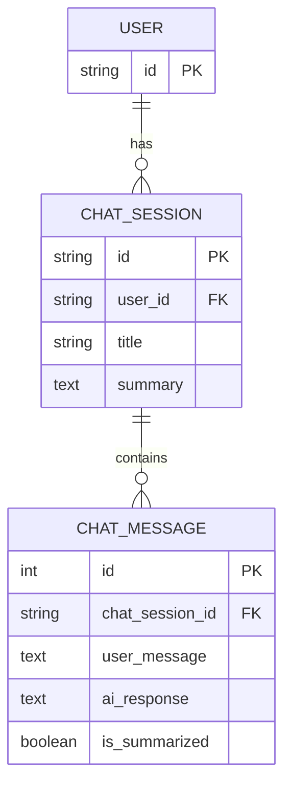

### 6.5 Vector Index Logical Schema

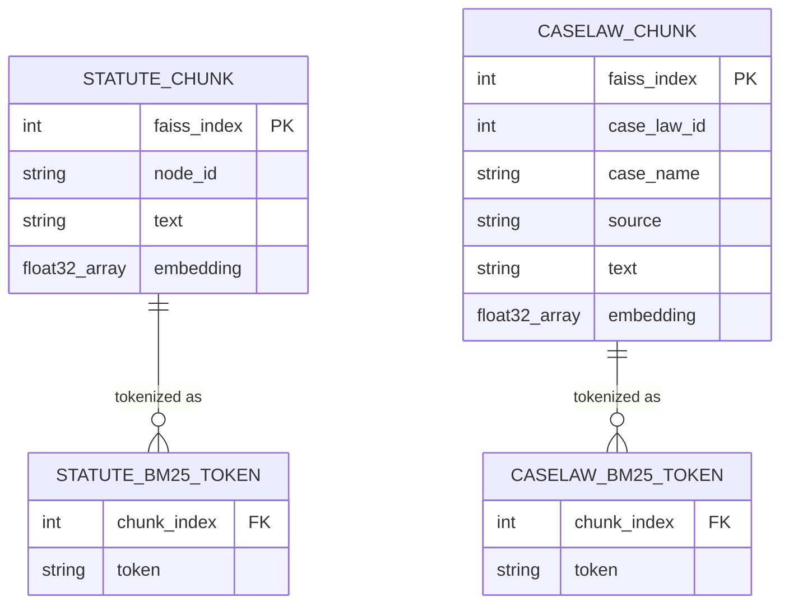

---

## 7. API Design

### 7.1 API Architecture Overview

The Legal RAG service exposes a **REST API** with 13 endpoints grouped into five functional areas:

- **AI Q&A:** The core RAG pipeline endpoint.
- **Session Management:** Create, title, and list sessions.
- **Chat CRUD:** Persist and retrieve individual Q&A exchanges.
- **Summary Management:** Read and write rolling session summaries.
- **Administration:** Rebuild vector indexes.

All request and response bodies are JSON. Authentication is via Bearer token in the `Authorization` header (see Section 8).

### 7.2 Endpoint Reference

#### 7.2.1 AI Q&A

---

**`POST /sessions/{session_id}/ask`**

| Attribute | Detail |
|---|---|
| **Purpose** | Execute the full RAG pipeline: retrieve relevant laws, generate an LLM answer, persist the exchange |
| **Path params** | `session_id` (string) — identifies the conversation session |
| **Request body** | `{"question": "string"}` |
| **Response** | `{"answer": "string", "full_laws": [ {"source": "statute"\|"caselaw", "text": "string", ...} ]}` |
| **Auth required** | Yes (Bearer token validated on startup; service-wide) |
| **Side effects** | Stores Q&A in Chat API; triggers background summarisation if count ≥ 5 |
| **Business purpose** | Core product feature: answer a legal query with grounded citations |

---

#### 7.2.2 Session Management

**`POST /sessions`**

| Attribute | Detail |
|---|---|
| **Purpose** | Create a new chat session |
| **Request body** | `{"user_id": "string", "title": "string (optional)"}` |
| **Response** | Session object from Chat API |
| **Auth required** | Yes |

**`PATCH /sessions/{session_id}/title`**

| Attribute | Detail |
|---|---|
| **Purpose** | Update the display title of a session |
| **Request body** | `{"title": "string"}` |
| **Response** | Updated session object |
| **Auth required** | Yes |

**`GET /history/{user_id}`**

| Attribute | Detail |
|---|---|
| **Purpose** | Retrieve all chat sessions for a given user |
| **Path params** | `user_id` (string) |
| **Response** | `{"user_id": "string", "sessions": [...]}` |
| **Auth required** | Yes |

---

#### 7.2.3 Chat CRUD

**`POST /sessions/{session_id}/chats`**

| Attribute | Detail |
|---|---|
| **Purpose** | Manually persist a Q&A pair (used for direct integration) |
| **Request body** | `{"user_message": "string", "ai_response": "string"}` |
| **Response** | `{"status": "created"}` |

**`GET /sessions/{session_id}/chats`**

| Attribute | Detail |
|---|---|
| **Purpose** | Retrieve all chat messages in a session |
| **Response** | `{"session_id": "string", "chats": [...]}` |

**`DELETE /sessions/{session_id}/chats`**

| Attribute | Detail |
|---|---|
| **Purpose** | Delete all chats in a session |
| **Response** | `{"status": "cleared"}` |

**`GET /sessions/{session_id}/count`**

| Attribute | Detail |
|---|---|
| **Purpose** | Get the count of chat messages (used to decide whether to summarise) |
| **Response** | `{"session_id": "string", "count": int}` |

---

#### 7.2.4 Summary Management

**`GET /sessions/{session_id}/summary`**

| Attribute | Detail |
|---|---|
| **Purpose** | Retrieve the current rolling summary for a session |
| **Response** | `{"session_id": "string", "summary": "string\|null"}` |

**`PATCH /sessions/{session_id}/summary`**

| Attribute | Detail |
|---|---|
| **Purpose** | Manually update a session summary |
| **Request body** | `{"summary": "string"}` |
| **Response** | `{"status": "updated"}` |

**`PATCH /mark-summarized`**

| Attribute | Detail |
|---|---|
| **Purpose** | Mark specific chat records as included in the rolling summary |
| **Request body** | `{"chat_ids": [int, ...]}` |
| **Response** | `{"status": "marked"}` |

---

#### 7.2.5 Administration

**`POST /vectordb/rebuild`**

| Attribute | Detail |
|---|---|
| **Purpose** | Rebuild both statute and case law FAISS indexes from the Admin API |
| **Response** | `{"status": "rebuilt", "statute_chunks": int, "caselaw_chunks": int}` |
| **Side effects** | Deletes all 6 index files; re-fetches all law data; re-loads stores into memory |

**`POST /vectordb/rebuild-caselaws`**

| Attribute | Detail |
|---|---|
| **Purpose** | Rebuild only the case law index (non-destructive to statute index) |
| **Response** | `{"status": "rebuilt", "caselaw_chunks": int}` |

---

### 7.3 Ask Endpoint Sequence Diagram

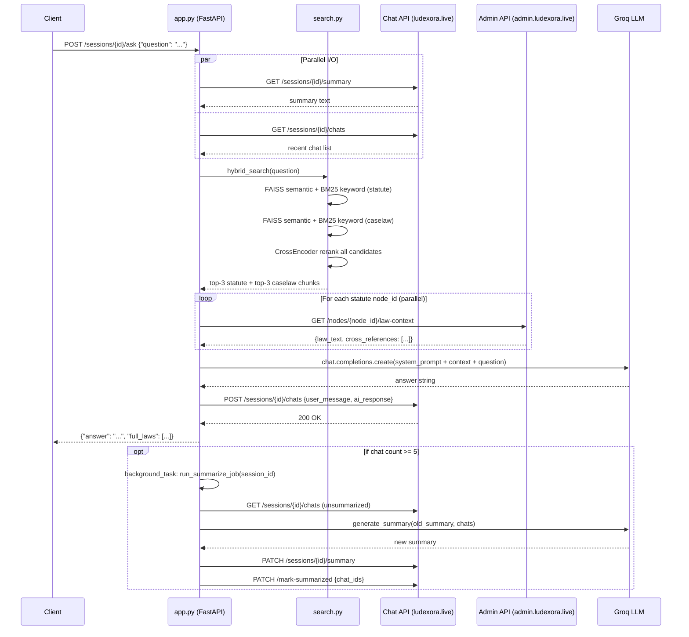

---

## 8. Authentication and Authorization

### 8.1 Authentication Mechanism

The service uses **Bearer Token authentication** (`Authorization: Bearer <token>`) for outbound calls to both external APIs. The token is configured via the `API_TOKEN` environment variable.

On startup, `client.py:check_api_token()` performs an eager validation by calling `GET /api/v1/nodes/leaf` on the Legal Admin API. A `401` response aborts startup with a `RuntimeError`, preventing the service from serving requests with an invalid token.

```python
# client.py:18-30
def check_api_token() -> None:
    if not API_TOKEN:
        raise RuntimeError("API_TOKEN is not set in .env")
    resp = _session.get(f"{API_BASE_URL}/api/v1/nodes/leaf", timeout=10)
    if resp.status_code == 401:
        raise RuntimeError(f"API_TOKEN is invalid — got 401 from {API_BASE_URL}")
```

The same token header is attached to all outbound requests via the shared `requests.Session` instance:
```python
# client.py:15
_session.headers.update(AUTH_HEADERS)
```

### 8.2 Inbound Authentication

The Legal RAG service's own endpoints do **not implement per-request authentication**. It is assumed that:
- The service is deployed behind a reverse proxy (e.g., nginx) or API gateway that enforces inbound authentication.
- The service is only accessible to trusted internal callers (the frontend and the Chat API backend on `ludexora.live`).

### 8.3 User Roles

| Role | Access Level |
|---|---|
| **End user** | Can call `/sessions/{id}/ask`, session CRUD, chat CRUD, history |
| **Administrator** | Has access to `/vectordb/rebuild*` endpoints — these should be protected at the network or reverse-proxy level |
| **Service token** | Single shared `API_TOKEN` used for all Admin API calls; no per-user token differentiation |

### 8.4 Security Controls

- **Secrets in environment variables:** `API_TOKEN` and `GROQ_API_KEY` are loaded from a `.env` file; the `.env` file is listed in `.gitignore`.
- **No SQL injection surface:** The service does not own or directly query a relational database.
- **Input validation:** Pydantic models validate all request bodies; FastAPI enforces type coercion.
- **Retry limits:** The HTTP adapter is configured with `total=2` retries — preventing runaway retry storms.
- **Timeout enforcement:** All outbound HTTP calls specify explicit `timeout` values (10–30 seconds).

---

## 9. Frontend Architecture

The Legal RAG service **does not include a frontend**. It is a pure backend API. The frontend is hosted separately at `https://ludexora.live` and communicates with this service and the Chat API independently. No frontend source code is present in this repository.

The following can be inferred about the expected frontend from the API contract:
- It manages user login and session creation via `POST /sessions`.
- It calls `POST /sessions/{id}/ask` to submit questions and receive answers.
- It renders `full_laws` returned by the ask endpoint to show citation sources.
- It retrieves chat history via `GET /sessions/{id}/chats` and session history via `GET /history/{user_id}`.

---

## 10. Backend Architecture

### 10.1 Service Structure

The backend is structured as a single Python package with flat module organisation — no sub-packages or nested directories. Each module maps to a distinct layer of responsibility:

```
legal-rag/
├── app.py           ← API + orchestration layer
├── search.py        ← retrieval layer
├── llm.py           ← generation layer
├── client.py        ← external I/O layer
├── ingest.py        ← ETL layer (statutes)
├── ingest_caselaw.py← ETL layer (case law)
├── ingest_api.py    ← ETL layer (legacy)
├── config.py        ← configuration layer
└── faiss_index/     ← local persistence layer
```

### 10.2 Business Logic Layers

| Layer | Module | Responsibility |
|---|---|---|
| API / Transport | `app.py` | HTTP routing, request/response serialisation, background task scheduling |
| Orchestration | `app.py` (`session_ask`, `_resolve_laws`) | Pipeline coordination, parallel I/O fan-out |
| Retrieval | `search.py` | Hybrid search, reranking |
| Generation | `llm.py` | Prompt construction, LLM call, response extraction |
| External I/O | `client.py` | HTTP to Chat API and Admin API |
| ETL | `ingest.py`, `ingest_caselaw.py` | Fetch → chunk → embed → index |
| Configuration | `config.py` | Environment-driven constants |

### 10.3 Background Jobs

One type of background job is implemented:

**Rolling Summarisation (`run_summarize_job`)**
- Trigger: `POST /sessions/{id}/ask` when `fetch_chat_count` returns ≥ `SUMMARIZE_THRESHOLD` (5).
- Execution: FastAPI `BackgroundTasks` — runs in the same process, after the HTTP response is sent.
- Steps: fetch unsummarised chats → call `generate_summary` (LLM) → patch session summary → mark chats as summarised.
- Purpose: Compress conversation history to stay within LLM context window limits over long sessions.

### 10.4 State Management

The service is designed to be **stateless** with respect to user data. The only in-process state is:
- `store` and `caselaw_store` (module-level dicts in `search.py`): Hold the loaded FAISS indexes and BM25 models in RAM. These are loaded once at startup and reloaded on index rebuild.
- `embedder` and `reranker` (module-level in `search.py`): Singleton ML model instances shared across all requests.

---

## 11. External Integrations

### 11.1 Legal Admin API (`admin.ludexora.live`)

**Purpose:** Source of truth for all legal content — both statutory law and case law.

**Endpoints consumed:**

| Endpoint | Method | Used by | Purpose |
|---|---|---|---|
| `/api/v1/nodes/leaf` | GET | `ingest.py`, `client.check_api_token` | Fetch all leaf law nodes for indexing; token validation |
| `/api/v1/nodes/{node_id}/law-path` | GET | `ingest.py`, `ingest_api.py` | Full law text for a single node (index build) |
| `/api/v1/nodes/{node_id}/law-context` | GET | `client.fetch_law_with_context` | Law text + cross-referenced nodes' law text (query time) |
| `/api/v1/case-laws` | GET | `ingest_caselaw.py` | All active case law records for indexing |

**Authentication:** Bearer token via `AUTH_HEADERS`.

### 11.2 Chat API (`ludexora.live`)

**Purpose:** External persistence layer for all session and chat data.

**Endpoints consumed:**

| Endpoint | Method | Used by | Purpose |
|---|---|---|---|
| `/api/chat/sessions` | POST | `create_session` | Create a new session |
| `/api/chat/sessions/{id}/title` | PATCH | `update_session_title` | Update session title |
| `/api/chat/sessions/{id}/chats` | POST | `store_chat` | Persist a Q&A exchange |
| `/api/chat/sessions/{id}/chats` | GET | `get_chats`, `fetch_unsummarized_chats` | Retrieve chats |
| `/api/chat/sessions/{id}/chats` | DELETE | `clear_chats` | Delete all session chats |
| `/api/chat/sessions/{id}/count` | GET | `fetch_chat_count` | Count chats in a session |
| `/api/chat/sessions/{id}/summary` | GET | `fetch_session_summary` | Get rolling summary |
| `/api/chat/sessions/{id}/summary` | PATCH | `update_session_summary` | Update rolling summary |
| `/api/chat/mark-summarized` | PATCH | `mark_chats_summarized` | Mark chat IDs as summarised |
| `/api/chat/history/{user_id}` | GET | `get_history` | All sessions for a user |

**Authentication:** Same Bearer token.

### 11.3 Groq LLM API

**Purpose:** Remote LLM inference provider.

| Attribute | Detail |
|---|---|
| **Endpoint** | `https://api.groq.com/openai/v1` |
| **SDK** | OpenAI Python SDK (Groq exposes OpenAI-compatible interface) |
| **Model** | `llama-3.1-8b-instant` (Meta Llama 3.1, 8B parameter, instruction-tuned) |
| **Auth** | `GROQ_API_KEY` environment variable |
| **Parameters** | Answer: temperature 0.2, max_tokens 1024; Summary: temperature 0.1, max_tokens 400 |
| **Called by** | `llm.generate_answer`, `llm.generate_summary` |

### 11.4 Hugging Face Model Hub (Implicit)

**Purpose:** Pre-trained model weights download at startup.

| Model | Usage | Downloaded by |
|---|---|---|
| `BAAI/bge-base-en-v1.5` | Text embedding (768-dim, normalised) | `sentence-transformers` |
| `BAAI/bge-reranker-base` | Cross-encoder reranking | `sentence-transformers` |

Models are cached locally by the `sentence-transformers` library after first download.

---

## 12. Infrastructure and Deployment

### 12.1 Hosting Architecture

Based on the codebase and configuration, the system is designed for a **single-server deployment** with the following structure:

- **Legal RAG service:** Python process running `uvicorn app:app` on a single Linux server.
- **Chat API backend:** Separate service at `ludexora.live` (not in this repository).
- **Legal Admin API:** Separate service at `admin.ludexora.live` (not in this repository).
- **LLM:** Groq cloud (no self-hosted inference).

### 12.2 Environment Configuration

Deployment requires a `.env` file with:

```env
API_BASE_URL=https://admin.ludexora.live/
CLIENT_BASE_URL=https://ludexora.live
API_TOKEN=<shared-bearer-token>
GROQ_API_KEY=<groq-api-key>
```

### 12.3 Runtime Dependencies

```
uvicorn        ← ASGI server
fastapi        ← HTTP framework
sentence-transformers ← BAAI models
faiss-cpu      ← vector search
rank-bm25      ← BM25 index
langchain-text-splitters ← chunking
openai         ← Groq SDK client
requests       ← outbound HTTP
python-dotenv  ← env loading
numpy          ← array operations
pypdf          ← PDF parsing (available but not currently used in main pipeline)
```

### 12.4 CI/CD

No CI/CD configuration files (GitHub Actions, Dockerfile, `docker-compose.yml`) are present in the repository. Deployment appears to be manual.

### 12.5 Deployment Diagram

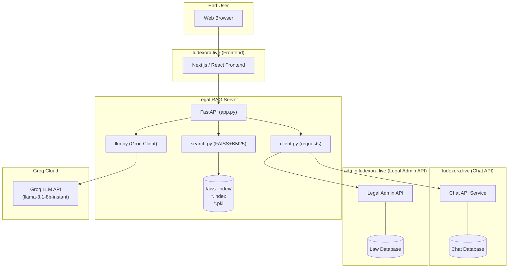

---

## 13. Data Flow Analysis

### 13.1 User Request Flow

1. **HTTP Request:** Client sends `POST /sessions/{id}/ask` with a question.
2. **Parallel I/O:** FastAPI launches two I/O futures — fetching the session summary and unsummarised chats from the Chat API.
3. **Hybrid Search:** Synchronously, the hybrid search runs against the in-memory FAISS and BM25 indexes.
4. **Candidate Union:** FAISS semantic hits and BM25 keyword hits are unioned per corpus.
5. **Reranking:** The CrossEncoder scores all candidates jointly; top-K from each corpus are selected.
6. **Context Enrichment:** For statute chunks, `fetch_law_with_context` fetches full text + cross-references from the Admin API (parallel threads).
7. **Prompt Assembly:** Summary + recent chats + enriched law blocks + question are assembled into a structured prompt.
8. **LLM Call:** Groq API generates the answer.
9. **Persistence:** The Q&A pair is stored in the Chat API.
10. **Response:** JSON with answer and cited law blocks is returned to the client.
11. **Background:** If chat count ≥ 5, summarisation runs asynchronously.

### 13.2 Data Processing Flow

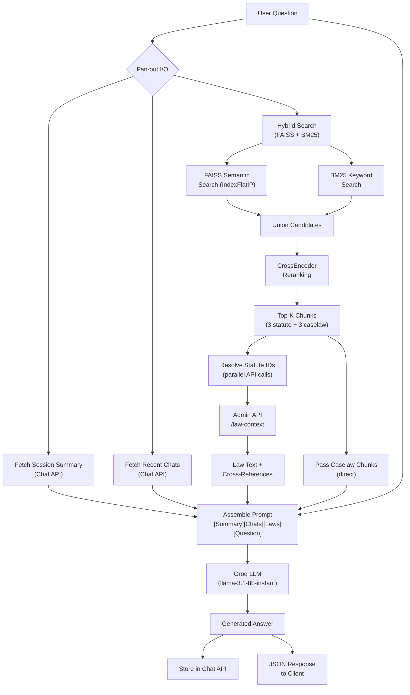

### 13.3 Ingestion / Index Build Flow

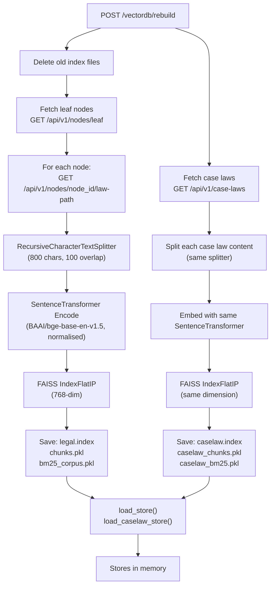

### 13.4 Rolling Summarisation Flow

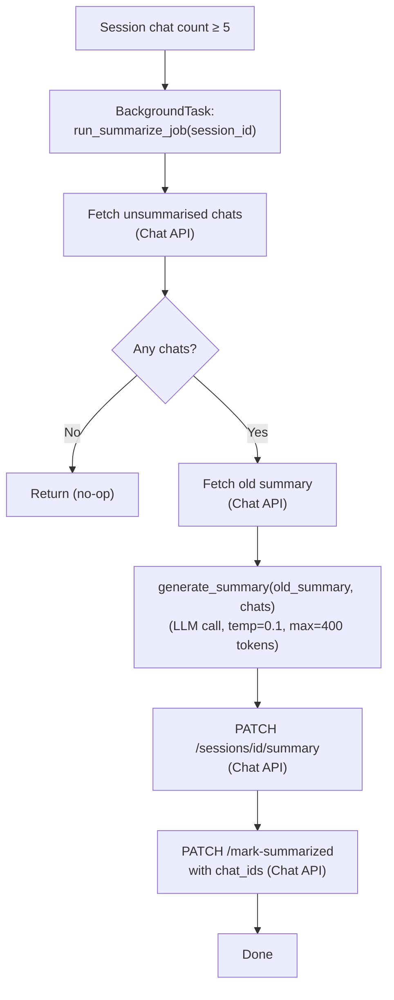

---

## 14. Design Patterns

### 14.1 Architectural Patterns

| Pattern | Where Applied | Evidence |
|---|---|---|
| **Retrieval-Augmented Generation (RAG)** | Core system | `hybrid_search` → `_resolve_laws` → `generate_answer` pipeline in `app.py` |
| **Layered Architecture** | Entire service | Distinct layers: API → orchestration → retrieval → generation → I/O |
| **Pipeline** | `session_ask` | Sequential stages: retrieve → enrich → generate → store |
| **Repository Pattern** | `client.py` | All external API interactions are encapsulated in typed functions; callers never handle HTTP directly |
| **Service Locator / Module Singleton** | `search.py` | `store` and `caselaw_store` are module-level singletons loaded once at startup |

### 14.2 Design Patterns

| Pattern | Where Applied | Evidence |
|---|---|---|
| **Two-Stage Retrieval** | `search.py:_candidates` + `hybrid_search` | Candidate retrieval (FAISS + BM25) followed by precise CrossEncoder reranking |
| **Sliding Window Chunking** | `ingest.py`, `ingest_caselaw.py` | `RecursiveCharacterTextSplitter(chunk_size=800, chunk_overlap=100)` |
| **Fan-Out / Scatter-Gather** | `app.py:session_ask` | Parallel I/O with `ThreadPoolExecutor`; results joined before proceeding |
| **Eager Validation / Fail Fast** | `client.py:check_api_token` | Token validated at startup; service refuses to start with bad credentials |
| **Strategy Pattern (implicit)** | `_resolve_laws` | Different resolution strategies for statute chunks vs caselaw chunks based on `source` discriminator |
| **Template Method** | `llm.py:generate_answer`, `generate_summary` | Both functions follow the same build-prompt → call-LLM → extract-response template |
| **Discriminated Union** | Chunk dicts | `source="caselaw"` discriminator separates two chunk types throughout the pipeline |
| **Rolling Summary / Memory Compression** | `run_summarize_job` | LLM-based compression of conversation history to maintain context window budget |

### 14.3 Best Practices

- **Environment-based configuration:** All secrets and URLs in `.env`, never hardcoded. Source: `config.py:1-9`.
- **Explicit timeouts:** Every outbound HTTP call specifies a `timeout` parameter to prevent hanging threads. Source: `client.py`.
- **Retry with back-off:** `urllib3.Retry` handles transient gateway failures gracefully. Source: `client.py:10-14`.
- **Normalised embeddings + IP index:** Using `normalize_embeddings=True` with `IndexFlatIP` is mathematically equivalent to cosine similarity — the correct metric for BGE models. Source: `ingest.py:33`, `search.py:65`.
- **BGE query prefix:** Applying the model-specific instruction prefix for queries only (not at index time) follows the BGE model's intended asymmetric retrieval paradigm. Source: `search.py:22`.
- **Background tasks:** Summarisation is offloaded to a `BackgroundTask` so the user-facing `/ask` response is not blocked. Source: `app.py:168`.

---

## 15. Non-Functional Requirements

### 15.1 Scalability

**Current state:** The service is a single-process uvicorn server with no horizontal scaling mechanism. The in-memory FAISS indexes and singleton ML model instances (`embedder`, `reranker`) are not process-safe for multi-worker deployments (multiple workers would each load ~1–2 GB of model weights independently).

**Mitigations present:**
- ThreadPoolExecutor for I/O-bound tasks (law fetches, summary/chat fetches).
- Connection pool in `client.py` (10 connections, 20 max) reuses TCP connections.

**Limitations:** Scaling beyond one uvicorn worker requires either moving to multi-process with shared memory for FAISS, or replacing FAISS with a dedicated vector database service (Pinecone, Weaviate, etc.).

### 15.2 Performance

- **Embedding:** `BAAI/bge-base-en-v1.5` on CPU; suitable for low-to-medium query rates. GPU would offer 10–20× speedup.
- **FAISS `IndexFlatIP`:** Exact (brute-force) search — O(n) per query. For corpus sizes typical of Sri Lankan statutes (likely hundreds to low thousands of chunks), this is acceptable.
- **CrossEncoder reranking:** Re-scores up to CANDIDATE_K (20) + CASELAW_CANDIDATE_K (15) = 35 pairs per query on CPU — the main latency bottleneck.
- **Parallel I/O:** `_io_executor` (4 workers) overlaps session summary and chat fetches with the synchronous vector search, hiding most external API latency.
- **LLM latency:** Groq's `llama-3.1-8b-instant` is optimised for low-latency inference (Groq LPU hardware).

### 15.3 Security

- **Token management:** Single shared API token for all outbound calls. No per-user token isolation for external APIs.
- **Inbound security:** No inbound authentication enforced at the application layer; depends on reverse proxy.
- **Secret exposure:** `.env` file is gitignored; `example .env` in the repository uses placeholder values.
- **No direct database access:** Eliminates SQL injection vectors.
- **Input validation:** Pydantic enforces request body schemas.

### 15.4 Reliability

- **Startup validation:** `check_api_token()` prevents the service from entering a broken state silently.
- **Graceful degradation:** Most `client.py` functions return empty collections (not exceptions) on HTTP failure — the system can continue serving requests even if the Chat API is temporarily unavailable.
- **Retry logic:** 2 retries on 502/503/504 responses handle transient infrastructure failures.
- **Caselaw store optional:** `load_caselaw_store()` is a no-op if index files are absent — the service starts successfully and serves statute-only results.

### 15.5 Maintainability

- **Single-responsibility modules:** Each file has a clear, documented purpose.
- **No framework lock-in for core logic:** The retrieval pipeline (`search.py`) and LLM calls (`llm.py`) are framework-agnostic — neither depends on FastAPI or LangChain internals.
- **Swappable LLM:** Using the OpenAI SDK interface means switching from Groq to OpenAI (or another OpenAI-compatible provider) requires only changing `api_key` and `base_url` in `llm.py`.
- **Separate rebuild endpoints:** `POST /vectordb/rebuild-caselaws` allows updating case law independently of statutes, reducing rebuild time during incremental updates.

### 15.6 Availability

The service's availability depends on three external systems: Legal Admin API, Chat API, and Groq. The FAISS indexes are persisted to disk, so a service restart does not require an index rebuild. The lack of a health-check or readiness endpoint (`/health`) is a notable gap.

---

## 16. Technology Stack

| Category | Technology | Version (inferred) | Role |
|---|---|---|---|
| **Language** | Python | 3.10+ (uses `dict \| None` union type syntax) | Primary runtime |
| **Web Framework** | FastAPI | Latest stable | HTTP API and request routing |
| **ASGI Server** | Uvicorn | Latest stable | Production HTTP server |
| **Data Validation** | Pydantic | v2 (`model_dump`) | Request/response schema validation |
| **Vector Database** | FAISS (`faiss-cpu`) | Latest stable | Dense vector approximate nearest neighbour search |
| **Sparse Retrieval** | `rank-bm25` | Latest stable | BM25 lexical search (Okapi BM25 variant) |
| **Embedding Model** | BAAI/bge-base-en-v1.5 | — | 768-dim sentence embeddings for asymmetric retrieval |
| **Reranker Model** | BAAI/bge-reranker-base | — | CrossEncoder pairwise relevance scoring |
| **ML Framework** | `sentence-transformers` | Latest stable | Model loading, encoding, cross-encoder inference |
| **Numerical Computing** | NumPy | Latest stable | Embedding array operations, BM25 score sorting |
| **Text Chunking** | LangChain Text Splitters (`langchain-text-splitters`) | Latest stable | Recursive character-based text splitting |
| **LLM Provider** | Groq API | — | Remote LLM inference |
| **LLM Model** | Meta Llama 3.1 8B Instant | — | Answer generation and summarisation |
| **LLM SDK** | OpenAI Python SDK | Latest stable | OpenAI-compatible API client (reused for Groq) |
| **HTTP Client** | `requests` + `urllib3` | Latest stable | Outbound API calls with retry and connection pooling |
| **Configuration** | `python-dotenv` | Latest stable | `.env` file loading |
| **Index Serialisation** | Python `pickle` | stdlib | Chunk and BM25 corpus persistence |
| **Version Control** | Git / GitHub | — | Source control; 9 merged PRs |

---

## 17. System Workflow

### 17.1 User Query Workflow

A user submits a legal question through the frontend. The RAG pipeline retrieves relevant statutory provisions and case law, enriches them with cross-references, and generates a grounded answer citing specific laws and cases.

**Activity Diagram:**

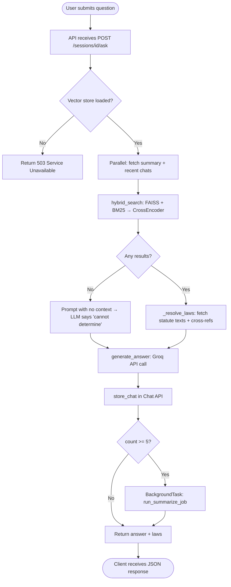

### 17.2 Index Build Workflow

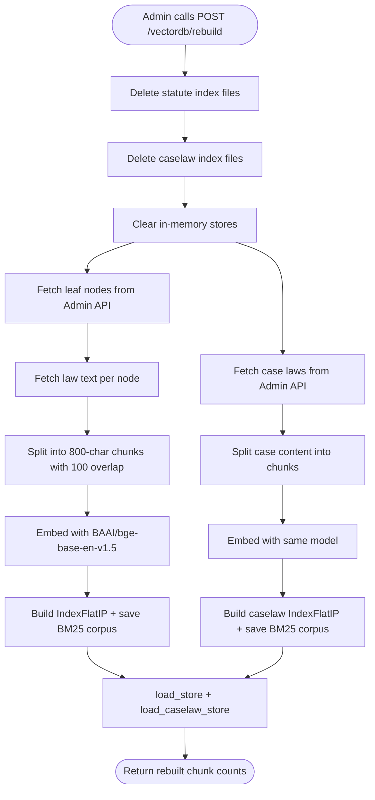

### 17.3 Rolling Summarisation Workflow

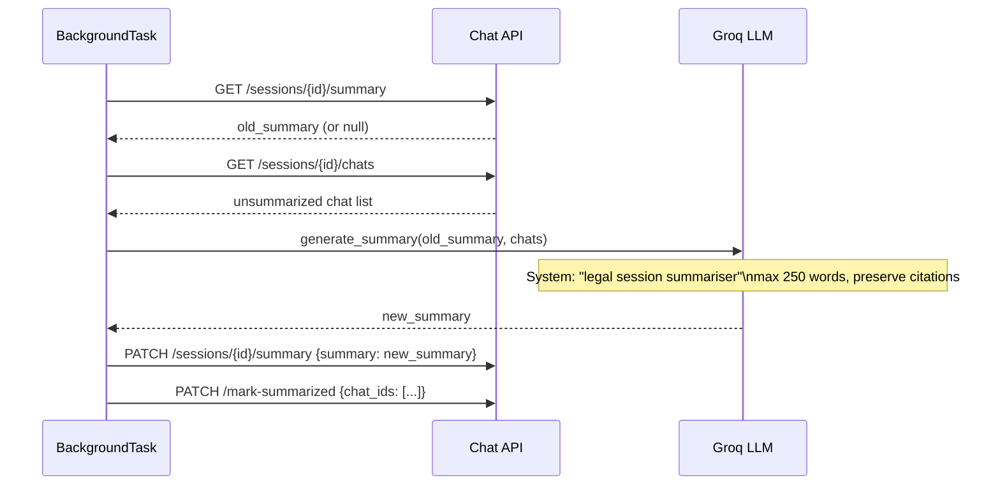

### 17.4 Component Diagram

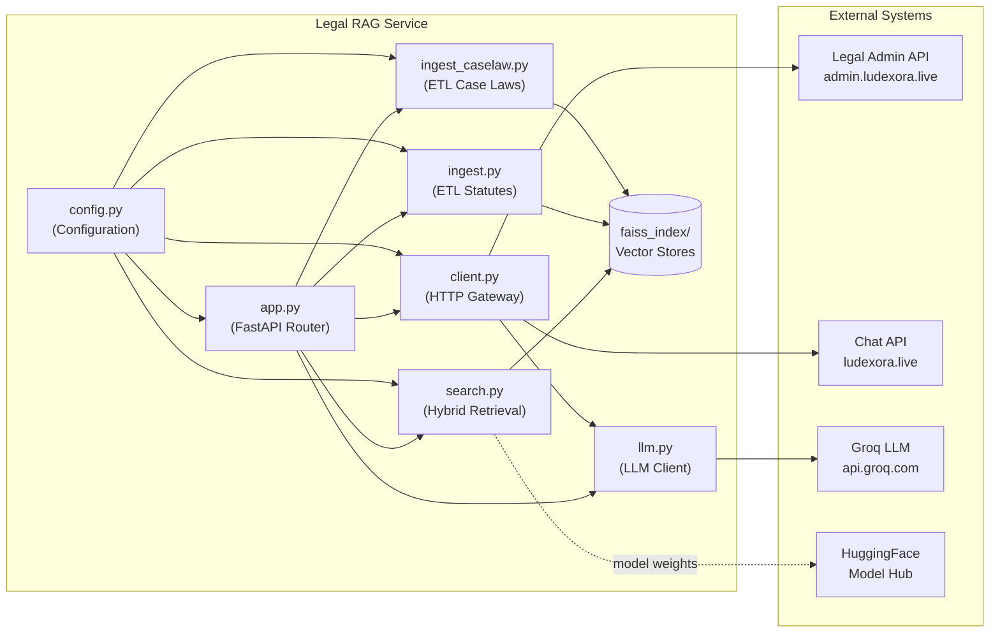

---

## 18. Thesis Documentation Section

### 18.1 System Analysis

The Legal RAG system addresses a well-established information retrieval challenge in the legal domain: the semantic gap between how laypersons articulate legal queries and how legal text is formally structured. Traditional keyword search systems fail to bridge this gap because legal provisions often do not contain the colloquial terms users employ. Pure semantic search, while capable of bridging vocabulary gaps, can miss exact statutory terminology that BM25-style keyword matching would catch reliably.

The system analysis reveals that this service occupies a specific niche within the legal technology (LegalTech) landscape: it is a grounded question-answering system rather than a document retrieval system. Unlike systems that return a list of potentially relevant documents, this service synthesises retrieved content into a coherent, citation-backed answer. This design decision trades the precision and verifiability of traditional document retrieval for the accessibility and directness of natural-language answers.

The dual-corpus design (statutes + case law) reflects a fundamental distinction in common law legal systems: statutes provide the formal rule, while case law illuminates how courts have interpreted and applied that rule. By integrating both, the system offers a richer understanding of the law than either corpus alone could provide.

### 18.2 System Design

The system is designed around three principles:

1. **Grounding over generation:** The LLM is constrained to answer only from the retrieved context, with an explicit system prompt instruction to refuse answering when the context is insufficient. This is enforced at the prompt level (`llm.py:12-19`) rather than technically, which means it relies on model instruction-following. Temperature 0.2 for answers and 0.1 for summaries further reduce hallucination risk by keeping outputs close to the input distribution.

2. **Hybrid retrieval over single-method retrieval:** The two-stage pipeline (FAISS + BM25 candidates → CrossEncoder reranking) is theoretically motivated: dense retrieval excels at semantic similarity while sparse retrieval captures exact term matches; the cross-encoder reranker, having access to both query and passage jointly, produces more accurate relevance scores than either retrieval model alone. This approach is consistent with the "retrieve and rerank" paradigm established in academic literature (Nogueira et al., 2019; Karpukhin et al., 2020).

3. **Externalised state:** By delegating all persistent state (sessions, chats, law content) to external APIs, the RAG service remains stateless and independently deployable. This design choice, while creating a dependency on two external systems, enables clean separation of concerns and allows the retrieval/generation logic to evolve independently of the data persistence layer.

### 18.3 Architectural Decisions

**Decision 1: FAISS over a managed vector database**

The system uses local FAISS binary files instead of a cloud vector database (Pinecone, Weaviate, Qdrant). This choice prioritises simplicity and cost — no additional managed service is required — at the expense of scalability and replication. For a research system with a bounded legal corpus size, this is an appropriate trade-off.

**Decision 2: Groq with `llama-3.1-8b-instant` over GPT-4**

The `llama-3.1-8b-instant` model on Groq hardware offers very low inference latency (Groq's LPU architecture) at a lower cost than OpenAI's GPT-4 family. The legal domain's structured nature (the answer must come from retrieved context) reduces the need for the parametric knowledge that larger models carry, making the 8B model a pragmatic choice.

**Decision 3: Hand-coded pipeline over LangChain agents**

The explicit architecture decision to avoid LangChain agent abstractions (`memory/project_overview.md`) produces a more transparent, debuggable, and controllable pipeline. Each step in the retrieve-enrich-generate flow is a direct Python function call with explicit inputs and outputs, making it straightforward to inspect, test, or replace any stage.

**Decision 4: Rolling summarisation over full history**

Passing the full chat history to the LLM would eventually exhaust the model's context window and increase inference cost linearly with session length. The rolling summarisation approach compresses prior exchanges into a ~250-word summary while retaining recent, unsummarised exchanges verbatim. This maintains conversational coherence at bounded context cost.

**Decision 5: Separate indexes for statutes and case law**

Statutes and case law have different retrieval semantics and different downstream handling (statutes require law-context API enrichment; case law is self-contained). Maintaining separate indexes and search configurations (different `CANDIDATE_K` values) allows fine-grained tuning of recall for each corpus.

### 18.4 Implementation Approach

The implementation follows a bottom-up module decomposition:
1. **Configuration first** (`config.py`): All constants and environment variables centralised.
2. **ETL scripts next** (`ingest.py`, `ingest_caselaw.py`): Build the knowledge base independently of the server.
3. **Search engine** (`search.py`): Pure retrieval logic, no FastAPI dependency.
4. **LLM integration** (`llm.py`): Pure generation logic, no retrieval dependency.
5. **External gateway** (`client.py`): All HTTP calls isolated from business logic.
6. **Orchestrator** (`app.py`): Wires all modules together, exposed as HTTP endpoints.

This layered bottom-up approach ensures each layer can be tested and reasoned about independently.

### 18.5 Advantages of the Chosen Architecture

1. **Factual grounding:** Constraining LLM output to retrieved context dramatically reduces hallucination — critical in a legal context where incorrect citations could mislead users.
2. **Transparency:** Returning `full_laws` in the API response allows clients to display source citations, enabling users to verify the answer against the original statute or case.
3. **Modularity:** The five-layer architecture allows replacement of any component (e.g., switching FAISS to Chroma, or Groq to OpenAI) with minimal code changes.
4. **Dual-corpus retrieval:** The combined statute + case law context gives the LLM both the rule and its judicial interpretation, producing more legally complete answers.
5. **Cost efficiency:** CPU inference for embedding and reranking, Groq for fast cheap LLM inference, and no managed vector database keep operational costs low.

### 18.6 Limitations

1. **Single-process bottleneck:** CPU-based embedding inference becomes a bottleneck under concurrent load. The CrossEncoder reranker is particularly expensive per query.
2. **Index staleness:** FAISS indexes are static snapshots. When new laws are enacted or case law is added, the index must be manually rebuilt via `/vectordb/rebuild`. There is no incremental update mechanism.
3. **No authentication at service boundary:** The RAG service's own endpoints are unauthenticated at the application layer, relying on infrastructure-level protection.
4. **Single shared token:** All users share one API token for external API calls, preventing per-user rate limiting or audit logging by the external services.
5. **No caching layer:** Repeated identical questions trigger full retrieval + LLM inference cycles. A query cache (e.g., exact-match or semantic cache) would reduce latency and cost for common questions.
6. **Chunking information loss:** Hard chunking at 800 characters with 100-character overlap may split statutory provisions mid-sentence, degrading retrieval quality for provisions longer than one chunk.
7. **LLM instruction-following dependence:** The grounding guarantee depends entirely on the LLM following the system prompt. More advanced constraint mechanisms (output parsing, retrieval verification) are not implemented.
8. **No observability:** There are no structured logs, metrics endpoints, or tracing instrumentation. Debugging production issues requires reviewing raw `print()` statements.

### 18.7 Future Improvements

1. **GPU deployment:** Moving embedding and reranking to a CUDA-capable GPU would reduce per-query latency by an order of magnitude.
2. **Approximate nearest neighbour:** Replacing `IndexFlatIP` with `IndexIVFFlat` or `IndexHNSW` would enable sublinear search time as the corpus grows.
3. **Incremental index updates:** Implementing an upsert mechanism for new law nodes and case laws would eliminate the need for full rebuilds.
4. **Per-user authentication:** Issuing per-user API tokens would enable audit trails and per-user rate limiting.
5. **Query caching:** A semantic cache (embedding-based similarity lookup of past queries) would serve repeated questions without re-running the full pipeline.
6. **Hallucination detection:** Adding a post-generation verification step (e.g., NLI-based entailment check against retrieved context) would provide a technical grounding guarantee beyond prompt instructions.
7. **Health and readiness endpoints:** A `/health` endpoint returning index status, model load status, and external API reachability would enable proper Kubernetes-style lifecycle management.
8. **Structured logging:** Replacing `print()` with a structured logger (e.g., `structlog`) and adding request IDs, latency metrics, and retrieval quality signals would enable production observability.
9. **Multi-lingual support:** Sri Lanka has Sinhala and Tamil-speaking populations. Extending the embedding model to support multilingual queries would broaden the system's reach.
10. **Evaluation framework:** Implementing a retrieval evaluation suite (MRR, NDCG against a labelled legal QA dataset) would enable systematic measurement of retrieval quality improvements.

---

## 19. Code Metrics

| Metric | Value | Source |
|---|---|---|
| **Total Python source files** | 7 (+ 1 legacy: `ingest_api.py`) | `find *.py` |
| **Total lines of code** | 894 | `wc -l *.py` |
| **API endpoints (this service)** | 13 | `app.py` routes |
| **External API endpoints consumed** | 14 | `client.py` functions |
| **Pydantic models** | 6 | `app.py:51-75` |
| **ThreadPoolExecutor pools** | 2 | `app.py:77, 148` |
| **Vector index files** | 6 | `faiss_index/` directory |
| **LLM functions** | 2 (`generate_answer`, `generate_summary`) | `llm.py` |
| **External service dependencies** | 3 (Legal Admin API, Chat API, Groq) | `client.py`, `llm.py` |
| **Pre-trained ML models** | 2 (embedder + reranker) | `search.py:16-17` |
| **Git commits** | 16 | `git log` |
| **Merged pull requests** | 9 | `git log` |
| **Configuration constants** | 12 | `config.py` |

### 19.1 Complexity Observations

- `app.py` is the most complex module (281 lines, 13 endpoints, 2 thread pools) and serves as the system's composition root. It has the highest coupling.
- `client.py` (217 lines) is the widest module in terms of external surface area — 15 functions, 14 distinct API calls.
- `search.py` (89 lines) achieves the most algorithmic work per line — implementing the full hybrid retrieval pipeline concisely.
- `llm.py` (89 lines) has the highest impact-to-size ratio — its system prompt defines the entire behaviour contract with the LLM.
- No module exceeds 281 lines, reflecting the thin-wrapper philosophy.
- Cyclomatic complexity is low throughout; the most complex function is `_resolve_laws` in `app.py` which branches on chunk type, parallelises HTTP calls, and deduplicates results.

---

## 20. Conclusion

The Legal RAG system is a well-architected, modular Python microservice that applies state-of-the-art information retrieval and natural language generation techniques to a practically important problem: democratising access to Sri Lankan Consumer Protection and Labour law.

Its core technical contribution is the **hybrid two-stage retrieval pipeline** — unioning FAISS semantic search with BM25 keyword matching and then reranking with a cross-encoder — applied over a **dual corpus** of statutes and case law. This pipeline design is theoretically grounded, practically efficient for the target corpus scale, and produces results that are richer than any single retrieval method would yield.

The system demonstrates sound software engineering principles: separation of concerns across clearly delineated modules, externalisation of all persistent state, fail-fast startup validation, concurrent I/O to mask external API latency, and a rolling summarisation strategy to maintain bounded conversation memory.

The key architectural trade-offs — FAISS over managed vector databases, a hand-coded pipeline over agent frameworks, CPU inference over GPU — are all consistent with the research and cost constraints of the project context. The most significant technical limitations (single-process bottleneck, no incremental index update, lack of observability) are well-understood and represent natural next steps on a clear improvement path.

The system achieves its primary goal — a grounded, citation-backed, conversational legal assistant — with approximately 900 lines of focused Python code, validating the value of a deliberately minimal, well-structured design.

---

*Document generated from source files: `app.py`, `config.py`, `search.py`, `llm.py`, `client.py`, `ingest.py`, `ingest_caselaw.py`, `ingest_api.py`, `requirements.txt`, `example .env`, `.gitignore`.*  
*Git history: commits `bcb1fa9` through `285046f`.*
